# Полный анализ сущностей ИС TechHub
## 157 таблиц базы данных

**Версия:** 1.0
**Дата:** 2025-12-04

---

## Содержание

1. [Сводная таблица всех сущностей](#1-сводная-таблица-всех-сущностей)
2. [Классификация сущностей по типам](#2-классификация-сущностей-по-типам)
3. [Анализ сущностей по модулям](#3-анализ-сущностей-по-модулям)
4. [Матрица связей](#4-матрица-связей)
5. [ER-диаграмма (PlantUML)](#5-er-диаграмма-plantuml)
6. [ER-диаграмма (Mermaid)](#6-er-диаграмма-mermaid)

---

## 1. Сводная таблица всех сущностей

| № | Таблица | Модуль | Записей | PK | FK | Описание |
|---|---------|--------|---------|----|----|----------|
| 1 | `account_activation` | account | 1,810 | id | 1 | Коды активации для подтверждения email/телефона |
| 2 | `account_certificate` | account | 1 | id | 1 | Сертификаты и достижения пользователя |
| 3 | `account_company` | account | 6,639 | id | 1 | Компания (юр.лицо или ИП) - резидент платформы |
| 4 | `account_complaint` | account | 20 | id | 3 | Жалобы на пользователей или компании |
| 5 | `account_contactpress` | account | 0 | id | 3 | Контакты для прессы |
| 6 | `account_contactrequest` | account | 0 | id | 2 | Запросы на контакт |
| 7 | `account_course` | account | 1 | id | 1 | Пройденные курсы пользователя |
| 8 | `account_education` | account | 1 | id | 1 | Образование пользователя |
| 9 | `account_emaildigest` | account | 31,474 | id | 0 | Подписки на email-рассылки |
| 10 | `account_experience` | account | 0 | id | 2 | Опыт работы пользователя |
| 11 | `account_user` | account | 54,063 | id | 2 | Пользователь системы - основная сущность для аутентификации и авторизации |
| 12 | `account_user_groups` | account | 109 | id | 2 | Связь пользователей с группами Django |
| 13 | `account_user_user_permissions` | account | 2,289 | id | 2 | Индивидуальные права пользователей |
| 14 | `account_usercompany` | account | 4,536 | id | 2 | Связь пользователя с компанией (M:N) с указанием роли |
| 15 | `account_usercompanyinvitation` | account | 2 | id | 3 | Приглашения в компанию |
| 16 | `account_usercompanyrequest` | account | 254 | id | 2 | Запросы на вступление в компанию |
| 17 | `admin_honeypot_loginattempt` | admin | 69,000 | id | 0 | Попытки входа в honeypot |
| 18 | `astanahub_shared_contextdata` | astanahub | 0 | id | 0 | Контекстные данные AstanaHub |
| 19 | `astanahub_shared_seodata` | astanahub | 0 | id | 0 | SEO данные AstanaHub |
| 20 | `astanahub_shared_smslog` | astanahub | 651 | id | 0 | SMS лог AstanaHub |
| 21 | `auth_group` | auth | 11 | id | 0 | Группа пользователей Django |
| 22 | `auth_group_permissions` | auth | 1,114 | id | 2 | Разрешения группы |
| 23 | `auth_permission` | auth | 625 | id | 1 | Разрешение Django |
| 24 | `authtoken_token` | authtoken | 1,138 | id | 1 | API токен пользователя |
| 25 | `awsdjangoses_awsblacklist` | awsdjangoses | 200 | id | 0 | Чёрный список AWS SES |
| 26 | `booking_booking` | booking | 8,673 | id | 3 | Бронирование комнаты |
| 27 | `booking_bookingstatus` | booking | 8,691 | id | 1 | История статусов бронирования |
| 28 | `booking_room` | booking | 16 | id | 0 | Комната для бронирования |
| 29 | `community_companyfollow` | community | 3 | id | 2 | Подписка на компанию |
| 30 | `community_userfollow` | community | 18 | id | 2 | Подписка на пользователя |
| 31 | `core_actionlog` | core | 124,987 | id | 1 | Лог действий пользователей |
| 32 | `core_article` | core | 83 | id | 2 | Официальная статья платформы |
| 33 | `core_banner` | core | 27 | id | 0 | Баннер на сайте |
| 34 | `core_blog` | core | 1,801 | id | 3 | Блог-пост пользователя или компании |
| 35 | `core_category` | core | 14 | id | 1 | Категория контента |
| 36 | `core_city` | core | 16 | id | 1 | Справочник городов |
| 37 | `core_comment` | core | 2,585 | id | 2 | Комментарий (полиморфный - к любой сущности) |
| 38 | `core_country` | core | 1 | id | 0 | Справочник стран |
| 39 | `core_discussion` | core | 157 | id | 2 | Обсуждение/дискуссия |
| 40 | `core_discussionvote` | core | 335 | id | 2 | Голос в обсуждении |
| 41 | `core_elabsannouncement` | core | 70 | id | 1 | Объявление E-Labs |
| 42 | `core_event` | core | 1,459 | id | 3 | Событие/мероприятие |
| 43 | `core_eventparticipant` | core | 864 | id | 2 | Участник события |
| 44 | `core_faq` | core | 7 | id | 0 | Раздел FAQ |
| 45 | `core_faqitem` | core | 46 | id | 1 | Вопрос-ответ в FAQ |
| 46 | `core_feed` | core | 4,789 | id | 6 | Лента новостей (агрегатор контента) |
| 47 | `core_floordata` | core | 16 | id | 0 | Данные этажа здания |
| 48 | `core_infrastructure` | core | 504 | id | 4 | Инфраструктурный объект |
| 49 | `core_infrastructureimage` | core | 397 | id | 2 | Изображение инфраструктуры |
| 50 | `core_infrastructurerequest` | core | 37 | id | 2 | Заявка на инфраструктуру |
| 51 | `core_notification` | core | 1,233 | id | 1 | Уведомление пользователю |
| 52 | `core_organization` | core | 45 | id | 0 | Организация-партнёр платформы (справочник) |
| 53 | `core_techtask` | core | 247 | id | 1 | Техническое задание на разработку |
| 54 | `core_techtasksolution` | core | 232 | id | 2 | Решение технического задания |
| 55 | `core_vacancy` | core | 1,205 | id | 3 | Вакансия от компании |
| 56 | `core_vacancycandidate` | core | 5,344 | id | 2 | Кандидат на вакансию |
| 57 | `core_vacancycandidate_certificates` | core | 192 | id | 0 | Сертификаты кандидата |
| 58 | `django_admin_log` | django | 42,696 | id | 2 | Лог админ-панели |
| 59 | `django_content_type` | django | 155 | id | 0 | Тип контента Django |
| 60 | `django_dramatiq_task` | django | 0 | id | 0 | Фоновые задачи Dramatiq |
| 61 | `django_migrations` | django | 819 | id | 0 | История миграций |
| 62 | `django_session` | django | 0 | id | 0 | Сессии Django |
| 63 | `explorer_query` | explorer | 6 | id | 1 | Сохранённый SQL запрос |
| 64 | `explorer_queryfavorite` | explorer | 0 | id | 2 | Избранный SQL запрос |
| 65 | `explorer_querylog` | explorer | 1,129 | id | 2 | Лог выполнения запросов |
| 66 | `hub_cache_table` | hub | 63 | id | 0 | Кэш-таблица |
| 67 | `journeymap_companystate` | journeymap | 0 | id | 2 | Состояние компании на карте |
| 68 | `journeymap_journeymap` | journeymap | 0 | id | 0 | Карта развития |
| 69 | `journeymap_question` | journeymap | 0 | id | 1 | Вопрос в задаче |
| 70 | `journeymap_step` | journeymap | 0 | id | 1 | Шаг карты развития |
| 71 | `journeymap_step_next_steps` | journeymap | 0 | id | 2 | Связи между шагами |
| 72 | `journeymap_task` | journeymap | 0 | id | 1 | Задача в шаге |
| 73 | `journeymap_userstate` | journeymap | 0 | id | 2 | Состояние пользователя на карте |
| 74 | `landing_component` | landing | 2,790 | id | 1 | Компонент секции |
| 75 | `landing_landing` | landing | 8 | id | 0 | Лендинг (устаревший) |
| 76 | `landing_page` | landing | 562 | id | 2 | Страница CMS |
| 77 | `landing_pagemediafile` | landing | 18,517 | id | 2 | Медиафайл страницы |
| 78 | `landing_section` | landing | 560 | id | 1 | Секция страницы |
| 79 | `matchmaking_match` | matchmaking | 31 | id | 2 | Мэтч между пользователями |
| 80 | `matchmaking_profile` | matchmaking | 19 | id | 1 | Профиль для нетворкинга |
| 81 | `niokr_niokrnotification` | niokr | 3 | id | 0 | Уведомление НИОКР |
| 82 | `niokr_niokrnotification_projects` | niokr | 2 | id | 2 | Связь уведомление-проект |
| 83 | `niokr_niokrproject` | niokr | 1 | id | 0 | Проект НИОКР |
| 84 | `niokr_niokrprojectexecutor` | niokr | 1 | id | 0 | Исполнитель проекта НИОКР |
| 85 | `niokr_niokrprojectexecutor_projects` | niokr | 1 | id | 2 | Связь исполнитель-проект |
| 86 | `oauth2_provider_accesstoken` | oauth2 | 9 | id | 4 | OAuth2 access token |
| 87 | `oauth2_provider_application` | oauth2 | 8 | id | 1 | OAuth2 приложение |
| 88 | `oauth2_provider_grant` | oauth2 | 1,037 | id | 2 | OAuth2 grant |
| 89 | `oauth2_provider_idtoken` | oauth2 | 0 | id | 2 | OAuth2 ID token |
| 90 | `oauth2_provider_refreshtoken` | oauth2 | 0 | id | 3 | OAuth2 refresh token |
| 91 | `reversion_revision` | reversion | 19,559 | id | 1 | Ревизия объекта |
| 92 | `reversion_version` | reversion | 9,281 | id | 2 | Версия объекта |
| 93 | `search_search` | search | 7,607 | id | 0 | Поисковый запрос |
| 94 | `service_amolog` | service | 0 | id | 1 | Лог интеграции с AmoCRM |
| 95 | `service_boxstorage` | service | 691 | id | 0 | Хранилище файлов |
| 96 | `service_documentologlog` | service | 1,117 | id | 0 | Лог интеграции с Documentolog |
| 97 | `service_expertdocument` | service | 0 | id | 2 | Документ от эксперта |
| 98 | `service_expertise` | service | 787 | id | 2 | Экспертиза заявки |
| 99 | `service_expertisegroup` | service | 13 | id | 1 | Группа экспертов для услуги |
| 100 | `service_expertisegroup_users` | service | 25 | id | 2 | Эксперты в группе |
| 101 | `service_externaldocument` | service | 195 | id | 1 | Внешний документ заявки |
| 102 | `service_externalhooklog` | service | 2,092 | id | 2 | Лог внешних webhook |
| 103 | `service_extradocument` | service | 101 | id | 2 | Дополнительный документ |
| 104 | `service_guppurchaseapplication` | service | 15 | id | 2 | Заявка на закупку ГУП |
| 105 | `service_guppurchaseplan` | service | 32 | id | 2 | План закупок ГУП |
| 106 | `service_gupreport` | service | 267 | id | 3 | Отчёт ГУП |
| 107 | `service_hubform` | service | 282 | id | 1 | Шаблон формы для заявки |
| 108 | `service_hubformdata` | service | 61,635 | id | 1 | Заполненные данные формы |
| 109 | `service_hubformfield` | service | 6,603 | id | 1 | Поле формы |
| 110 | `service_hubformstep` | service | 569 | id | 1 | Шаг формы |
| 111 | `service_pitchinggrade` | service | 1,538 | id | 2 | Оценка питчинга |
| 112 | `service_protocol` | service | 104 | id | 1 | Протокол комиссии |
| 113 | `service_protocol_accepted` | service | 467 | id | 2 | Одобренные заявки в протоколе |
| 114 | `service_protocol_rejected` | service | 606 | id | 2 | Отклонённые заявки в протоколе |
| 115 | `service_report` | service | 13,110 | id | 2 | Отчёт по заявке |
| 116 | `service_seedmoneyreport` | service | 333 | id | 3 | Отчёт по гранту Seed Money |
| 117 | `service_service` | service | 310 | id | 4 | Услуга/сервис платформы (справочник) |
| 118 | `service_service_users` | service | 906 | id | 2 | Менеджеры услуги |
| 119 | `service_servicenote` | service | 2 | id | 2 | Заметка к услуге |
| 120 | `service_servicerequest` | service | 56,322 | id | 8 | Заявка на услугу |
| 121 | `service_servicerequestbpstatus` | service | 82,810 | id | 2 | Статус бизнес-процесса заявки |
| 122 | `service_servicerequestlog` | service | 4,571 | id | 2 | Лог изменений заявки |
| 123 | `service_servicerequeststatus` | service | 2,031 | id | 2 | История статусов заявки |
| 124 | `service_techordareport` | service | 503 | id | 2 | Отчёт TechOrda |
| 125 | `service_techordareportstudent` | service | 4 | id | 2 | Студент в отчёте TechOrda |
| 126 | `service_techordastudent` | service | 3,307 | id | 0 | Студент TechOrda |
| 127 | `service_vote` | service | 12,945 | id | 3 | Голос эксперта по заявке |
| 128 | `shared_contextdata` | shared | 243 | id | 0 | Контекстные данные |
| 129 | `shared_largecache` | shared | 2 | id | 0 | Кэш больших объектов |
| 130 | `shared_mediafile` | shared | 50,936 | id | 1 | Медиафайл (публичный) |
| 131 | `shared_protectedmediafile` | shared | 92,960 | id | 1 | Медиафайл (защищённый) |
| 132 | `shared_seodata` | shared | 97 | id | 0 | SEO данные страницы |
| 133 | `shared_smslog` | shared | 0 | id | 0 | Лог SMS сообщений |
| 134 | `silk_profile` | silk | 0 | id | 1 | Профиль производительности |
| 135 | `silk_profile_queries` | silk | 0 | id | 2 | Связь профиль-запросы |
| 136 | `silk_request` | silk | 73 | id | 0 | Профилирование запроса |
| 137 | `silk_response` | silk | 73 | id | 1 | Профилирование ответа |
| 138 | `silk_sqlquery` | silk | 571 | id | 1 | Профилирование SQL |
| 139 | `social_auth_association` | social | 0 | id | 0 | OAuth ассоциация |
| 140 | `social_auth_code` | social | 0 | id | 0 | OAuth код |
| 141 | `social_auth_nonce` | social | 0 | id | 0 | OAuth nonce |
| 142 | `social_auth_partial` | social | 0 | id | 0 | OAuth частичные данные |
| 143 | `social_auth_usersocialauth` | social | 19,505 | id | 1 | OAuth привязка (Google и др.) |
| 144 | `techorda_applicationform` | techorda | 19 | id | 3 | Форма заявки на обучение |
| 145 | `techorda_assessment` | techorda | 45 | id | 0 | Оценка/тестирование |
| 146 | `techorda_course` | techorda | 203 | id | 2 | Курс обучения |
| 147 | `techorda_courseapplication` | techorda | 15 | id | 3 | Заявка на курс |
| 148 | `techorda_coursefavorite` | techorda | 16 | id | 2 | Избранный курс пользователя |
| 149 | `techorda_flow` | techorda | 4 | id | 0 | Поток обучения (набор) |
| 150 | `techorda_school` | techorda | 82 | id | 2 | Школа/провайдер обучения |
| 151 | `thumbnail_kvstore` | thumbnail | 230,644 | id | 0 | Кэш превью изображений |
| 152 | `user_sessions_session` | user | 2,952,046 | id | 1 | Расширенная сессия пользователя |
| 153 | `waffle_flag` | waffle | 56 | id | 0 | Feature flag |
| 154 | `waffle_flag_groups` | waffle | 2 | id | 2 | Feature flag для групп |
| 155 | `waffle_flag_users` | waffle | 24 | id | 2 | Feature flag для пользователей |
| 156 | `waffle_sample` | waffle | 0 | id | 0 | Семплирование feature |
| 157 | `waffle_switch` | waffle | 44 | id | 0 | Переключатель feature |

---

## 2. Классификация сущностей по типам

### Основная (15 таблиц)

- `account_company` - Компания (юр.лицо или ИП) - резидент платформы
- `account_user` - Пользователь системы - основная сущность для аутентификации и авторизации
- `booking_booking` - Бронирование комнаты
- `core_article` - Официальная статья платформы
- `core_blog` - Блог-пост пользователя или компании
- `core_event` - Событие/мероприятие
- `core_infrastructure` - Инфраструктурный объект
- `core_techtask` - Техническое задание на разработку
- `core_vacancy` - Вакансия от компании
- `journeymap_journeymap` - Карта развития
- `landing_page` - Страница CMS
- `niokr_niokrproject` - Проект НИОКР
- `service_servicerequest` - Заявка на услугу
- `techorda_course` - Курс обучения
- `techorda_school` - Школа/провайдер обучения

### Справочник (13 таблиц)

- `auth_group` - Группа пользователей Django
- `auth_permission` - Разрешение Django
- `booking_room` - Комната для бронирования
- `core_category` - Категория контента
- `core_city` - Справочник городов
- `core_country` - Справочник стран
- `core_faq` - Раздел FAQ
- `core_organization` - Организация-партнёр платформы (справочник)
- `django_content_type` - Тип контента Django
- `service_service` - Услуга/сервис платформы (справочник)
- `techorda_flow` - Поток обучения (набор)
- `waffle_flag` - Feature flag
- `waffle_switch` - Переключатель feature

### Связующая (15 таблиц)

- `account_user_groups` - Связь пользователей с группами Django
- `account_user_user_permissions` - Индивидуальные права пользователей
- `account_usercompany` - Связь пользователя с компанией (M:N) с указанием роли
- `auth_group_permissions` - Разрешения группы
- `core_vacancycandidate_certificates` - Сертификаты кандидата
- `journeymap_step_next_steps` - Связи между шагами
- `niokr_niokrnotification_projects` - Связь уведомление-проект
- `niokr_niokrprojectexecutor_projects` - Связь исполнитель-проект
- `service_expertisegroup_users` - Эксперты в группе
- `service_protocol_accepted` - Одобренные заявки в протоколе
- `service_protocol_rejected` - Отклонённые заявки в протоколе
- `service_service_users` - Менеджеры услуги
- `silk_profile_queries` - Связь профиль-запросы
- `waffle_flag_groups` - Feature flag для групп
- `waffle_flag_users` - Feature flag для пользователей

### Форма (4 таблиц)

- `service_hubform` - Шаблон формы для заявки
- `service_hubformfield` - Поле формы
- `service_hubformstep` - Шаг формы
- `techorda_applicationform` - Форма заявки на обучение

### Данные формы (1 таблиц)

- `service_hubformdata` - Заполненные данные формы

### Лог (10 таблиц)

- `admin_honeypot_loginattempt` - Попытки входа в honeypot
- `astanahub_shared_smslog` - SMS лог AstanaHub
- `core_actionlog` - Лог действий пользователей
- `django_admin_log` - Лог админ-панели
- `explorer_querylog` - Лог выполнения запросов
- `service_amolog` - Лог интеграции с AmoCRM
- `service_documentologlog` - Лог интеграции с Documentolog
- `service_externalhooklog` - Лог внешних webhook
- `service_servicerequestlog` - Лог изменений заявки
- `shared_smslog` - Лог SMS сообщений

### Транзакционная (99 таблиц)

- `account_activation` - Коды активации для подтверждения email/телефона
- `account_certificate` - Сертификаты и достижения пользователя
- `account_complaint` - Жалобы на пользователей или компании
- `account_contactpress` - Контакты для прессы
- `account_contactrequest` - Запросы на контакт
- `account_course` - Пройденные курсы пользователя
- `account_education` - Образование пользователя
- `account_emaildigest` - Подписки на email-рассылки
- `account_experience` - Опыт работы пользователя
- `account_usercompanyinvitation` - Приглашения в компанию
- `account_usercompanyrequest` - Запросы на вступление в компанию
- `astanahub_shared_contextdata` - Контекстные данные AstanaHub
- `astanahub_shared_seodata` - SEO данные AstanaHub
- `authtoken_token` - API токен пользователя
- `awsdjangoses_awsblacklist` - Чёрный список AWS SES
- `booking_bookingstatus` - История статусов бронирования
- `community_companyfollow` - Подписка на компанию
- `community_userfollow` - Подписка на пользователя
- `core_banner` - Баннер на сайте
- `core_comment` - Комментарий (полиморфный - к любой сущности)
- `core_discussion` - Обсуждение/дискуссия
- `core_discussionvote` - Голос в обсуждении
- `core_elabsannouncement` - Объявление E-Labs
- `core_eventparticipant` - Участник события
- `core_faqitem` - Вопрос-ответ в FAQ
- `core_feed` - Лента новостей (агрегатор контента)
- `core_floordata` - Данные этажа здания
- `core_infrastructureimage` - Изображение инфраструктуры
- `core_infrastructurerequest` - Заявка на инфраструктуру
- `core_notification` - Уведомление пользователю
- `core_techtasksolution` - Решение технического задания
- `core_vacancycandidate` - Кандидат на вакансию
- `django_dramatiq_task` - Фоновые задачи Dramatiq
- `django_migrations` - История миграций
- `django_session` - Сессии Django
- `explorer_query` - Сохранённый SQL запрос
- `explorer_queryfavorite` - Избранный SQL запрос
- `hub_cache_table` - Кэш-таблица
- `journeymap_companystate` - Состояние компании на карте
- `journeymap_question` - Вопрос в задаче
- `journeymap_step` - Шаг карты развития
- `journeymap_task` - Задача в шаге
- `journeymap_userstate` - Состояние пользователя на карте
- `landing_component` - Компонент секции
- `landing_landing` - Лендинг (устаревший)
- `landing_pagemediafile` - Медиафайл страницы
- `landing_section` - Секция страницы
- `matchmaking_match` - Мэтч между пользователями
- `matchmaking_profile` - Профиль для нетворкинга
- `niokr_niokrnotification` - Уведомление НИОКР
- `niokr_niokrprojectexecutor` - Исполнитель проекта НИОКР
- `oauth2_provider_accesstoken` - OAuth2 access token
- `oauth2_provider_application` - OAuth2 приложение
- `oauth2_provider_grant` - OAuth2 grant
- `oauth2_provider_idtoken` - OAuth2 ID token
- `oauth2_provider_refreshtoken` - OAuth2 refresh token
- `reversion_revision` - Ревизия объекта
- `reversion_version` - Версия объекта
- `search_search` - Поисковый запрос
- `service_boxstorage` - Хранилище файлов
- `service_expertdocument` - Документ от эксперта
- `service_expertise` - Экспертиза заявки
- `service_expertisegroup` - Группа экспертов для услуги
- `service_externaldocument` - Внешний документ заявки
- `service_extradocument` - Дополнительный документ
- `service_guppurchaseapplication` - Заявка на закупку ГУП
- `service_guppurchaseplan` - План закупок ГУП
- `service_gupreport` - Отчёт ГУП
- `service_pitchinggrade` - Оценка питчинга
- `service_protocol` - Протокол комиссии
- `service_report` - Отчёт по заявке
- `service_seedmoneyreport` - Отчёт по гранту Seed Money
- `service_servicenote` - Заметка к услуге
- `service_servicerequestbpstatus` - Статус бизнес-процесса заявки
- `service_servicerequeststatus` - История статусов заявки
- `service_techordareport` - Отчёт TechOrda
- `service_techordareportstudent` - Студент в отчёте TechOrda
- `service_techordastudent` - Студент TechOrda
- `service_vote` - Голос эксперта по заявке
- `shared_contextdata` - Контекстные данные
- `shared_largecache` - Кэш больших объектов
- `shared_mediafile` - Медиафайл (публичный)
- `shared_protectedmediafile` - Медиафайл (защищённый)
- `shared_seodata` - SEO данные страницы
- `silk_profile` - Профиль производительности
- `silk_request` - Профилирование запроса
- `silk_response` - Профилирование ответа
- `silk_sqlquery` - Профилирование SQL
- `social_auth_association` - OAuth ассоциация
- `social_auth_code` - OAuth код
- `social_auth_nonce` - OAuth nonce
- `social_auth_partial` - OAuth частичные данные
- `social_auth_usersocialauth` - OAuth привязка (Google и др.)
- `techorda_assessment` - Оценка/тестирование
- `techorda_courseapplication` - Заявка на курс
- `techorda_coursefavorite` - Избранный курс пользователя
- `thumbnail_kvstore` - Кэш превью изображений
- `user_sessions_session` - Расширенная сессия пользователя
- `waffle_sample` - Семплирование feature

---

## 3. Анализ сущностей по модулям

### Модуль: account

**Описание:** Управление пользователями и компаниями
**Таблиц:** 16
**Всего записей:** 101,199

| Таблица | Тип | Записей | Описание |
|---------|-----|---------|----------|
| `account_activation` | Транзакционная | 1,810 | Коды активации для подтверждения email/телефона |
| `account_certificate` | Транзакционная | 1 | Сертификаты и достижения пользователя |
| `account_company` | Основная | 6,639 | Компания (юр.лицо или ИП) - резидент платформы |
| `account_complaint` | Транзакционная | 20 | Жалобы на пользователей или компании |
| `account_contactpress` | Транзакционная | 0 | Контакты для прессы |
| `account_contactrequest` | Транзакционная | 0 | Запросы на контакт |
| `account_course` | Транзакционная | 1 | Пройденные курсы пользователя |
| `account_education` | Транзакционная | 1 | Образование пользователя |
| `account_emaildigest` | Транзакционная | 31,474 | Подписки на email-рассылки |
| `account_experience` | Транзакционная | 0 | Опыт работы пользователя |
| `account_user` | Основная | 54,063 | Пользователь системы - основная сущность для аутентификации и авторизации |
| `account_user_groups` | Связующая | 109 | Связь пользователей с группами Django |
| `account_user_user_permissions` | Связующая | 2,289 | Индивидуальные права пользователей |
| `account_usercompany` | Связующая | 4,536 | Связь пользователя с компанией (M:N) с указанием роли |
| `account_usercompanyinvitation` | Транзакционная | 2 | Приглашения в компанию |
| `account_usercompanyrequest` | Транзакционная | 254 | Запросы на вступление в компанию |

### Модуль: admin

**Описание:** Honeypot админки
**Таблиц:** 1
**Всего записей:** 69,000

| Таблица | Тип | Записей | Описание |
|---------|-----|---------|----------|
| `admin_honeypot_loginattempt` | Лог | 69,000 | Попытки входа в honeypot |

### Модуль: astanahub

**Описание:** Данные AstanaHub
**Таблиц:** 3
**Всего записей:** 651

| Таблица | Тип | Записей | Описание |
|---------|-----|---------|----------|
| `astanahub_shared_contextdata` | Транзакционная | 0 | Контекстные данные AstanaHub |
| `astanahub_shared_seodata` | Транзакционная | 0 | SEO данные AstanaHub |
| `astanahub_shared_smslog` | Лог | 651 | SMS лог AstanaHub |

### Модуль: auth

**Описание:** Аутентификация Django
**Таблиц:** 3
**Всего записей:** 1,750

| Таблица | Тип | Записей | Описание |
|---------|-----|---------|----------|
| `auth_group` | Справочник | 11 | Группа пользователей Django |
| `auth_group_permissions` | Связующая | 1,114 | Разрешения группы |
| `auth_permission` | Справочник | 625 | Разрешение Django |

### Модуль: authtoken

**Описание:** API токены
**Таблиц:** 1
**Всего записей:** 1,138

| Таблица | Тип | Записей | Описание |
|---------|-----|---------|----------|
| `authtoken_token` | Транзакционная | 1,138 | API токен пользователя |

### Модуль: awsdjangoses

**Описание:** AWS SES интеграция
**Таблиц:** 1
**Всего записей:** 200

| Таблица | Тип | Записей | Описание |
|---------|-----|---------|----------|
| `awsdjangoses_awsblacklist` | Транзакционная | 200 | Чёрный список AWS SES |

### Модуль: booking

**Описание:** Бронирование помещений
**Таблиц:** 3
**Всего записей:** 17,380

| Таблица | Тип | Записей | Описание |
|---------|-----|---------|----------|
| `booking_booking` | Основная | 8,673 | Бронирование комнаты |
| `booking_bookingstatus` | Транзакционная | 8,691 | История статусов бронирования |
| `booking_room` | Справочник | 16 | Комната для бронирования |

### Модуль: community

**Описание:** Социальные связи
**Таблиц:** 2
**Всего записей:** 21

| Таблица | Тип | Записей | Описание |
|---------|-----|---------|----------|
| `community_companyfollow` | Транзакционная | 3 | Подписка на компанию |
| `community_userfollow` | Транзакционная | 18 | Подписка на пользователя |

### Модуль: core

**Описание:** Основной контент платформы
**Таблиц:** 27
**Всего записей:** 146,693

| Таблица | Тип | Записей | Описание |
|---------|-----|---------|----------|
| `core_actionlog` | Лог | 124,987 | Лог действий пользователей |
| `core_article` | Основная | 83 | Официальная статья платформы |
| `core_banner` | Транзакционная | 27 | Баннер на сайте |
| `core_blog` | Основная | 1,801 | Блог-пост пользователя или компании |
| `core_category` | Справочник | 14 | Категория контента |
| `core_city` | Справочник | 16 | Справочник городов |
| `core_comment` | Транзакционная | 2,585 | Комментарий (полиморфный - к любой сущности) |
| `core_country` | Справочник | 1 | Справочник стран |
| `core_discussion` | Транзакционная | 157 | Обсуждение/дискуссия |
| `core_discussionvote` | Транзакционная | 335 | Голос в обсуждении |
| `core_elabsannouncement` | Транзакционная | 70 | Объявление E-Labs |
| `core_event` | Основная | 1,459 | Событие/мероприятие |
| `core_eventparticipant` | Транзакционная | 864 | Участник события |
| `core_faq` | Справочник | 7 | Раздел FAQ |
| `core_faqitem` | Транзакционная | 46 | Вопрос-ответ в FAQ |
| `core_feed` | Транзакционная | 4,789 | Лента новостей (агрегатор контента) |
| `core_floordata` | Транзакционная | 16 | Данные этажа здания |
| `core_infrastructure` | Основная | 504 | Инфраструктурный объект |
| `core_infrastructureimage` | Транзакционная | 397 | Изображение инфраструктуры |
| `core_infrastructurerequest` | Транзакционная | 37 | Заявка на инфраструктуру |
| `core_notification` | Транзакционная | 1,233 | Уведомление пользователю |
| `core_organization` | Справочник | 45 | Организация-партнёр платформы (справочник) |
| `core_techtask` | Основная | 247 | Техническое задание на разработку |
| `core_techtasksolution` | Транзакционная | 232 | Решение технического задания |
| `core_vacancy` | Основная | 1,205 | Вакансия от компании |
| `core_vacancycandidate` | Транзакционная | 5,344 | Кандидат на вакансию |
| `core_vacancycandidate_certificates` | Связующая | 192 | Сертификаты кандидата |

### Модуль: django

**Описание:** Системные таблицы
**Таблиц:** 5
**Всего записей:** 43,670

| Таблица | Тип | Записей | Описание |
|---------|-----|---------|----------|
| `django_admin_log` | Лог | 42,696 | Лог админ-панели |
| `django_content_type` | Справочник | 155 | Тип контента Django |
| `django_dramatiq_task` | Транзакционная | 0 | Фоновые задачи Dramatiq |
| `django_migrations` | Транзакционная | 819 | История миграций |
| `django_session` | Транзакционная | 0 | Сессии Django |

### Модуль: explorer

**Описание:** SQL аналитика
**Таблиц:** 3
**Всего записей:** 1,135

| Таблица | Тип | Записей | Описание |
|---------|-----|---------|----------|
| `explorer_query` | Транзакционная | 6 | Сохранённый SQL запрос |
| `explorer_queryfavorite` | Транзакционная | 0 | Избранный SQL запрос |
| `explorer_querylog` | Лог | 1,129 | Лог выполнения запросов |

### Модуль: hub

**Описание:** Кэш
**Таблиц:** 1
**Всего записей:** 63

| Таблица | Тип | Записей | Описание |
|---------|-----|---------|----------|
| `hub_cache_table` | Транзакционная | 63 | Кэш-таблица |

### Модуль: journeymap

**Описание:** Карты развития
**Таблиц:** 7
**Всего записей:** 0

| Таблица | Тип | Записей | Описание |
|---------|-----|---------|----------|
| `journeymap_companystate` | Транзакционная | 0 | Состояние компании на карте |
| `journeymap_journeymap` | Основная | 0 | Карта развития |
| `journeymap_question` | Транзакционная | 0 | Вопрос в задаче |
| `journeymap_step` | Транзакционная | 0 | Шаг карты развития |
| `journeymap_step_next_steps` | Связующая | 0 | Связи между шагами |
| `journeymap_task` | Транзакционная | 0 | Задача в шаге |
| `journeymap_userstate` | Транзакционная | 0 | Состояние пользователя на карте |

### Модуль: landing

**Описание:** CMS для страниц
**Таблиц:** 5
**Всего записей:** 22,437

| Таблица | Тип | Записей | Описание |
|---------|-----|---------|----------|
| `landing_component` | Транзакционная | 2,790 | Компонент секции |
| `landing_landing` | Транзакционная | 8 | Лендинг (устаревший) |
| `landing_page` | Основная | 562 | Страница CMS |
| `landing_pagemediafile` | Транзакционная | 18,517 | Медиафайл страницы |
| `landing_section` | Транзакционная | 560 | Секция страницы |

### Модуль: matchmaking

**Описание:** Нетворкинг
**Таблиц:** 2
**Всего записей:** 50

| Таблица | Тип | Записей | Описание |
|---------|-----|---------|----------|
| `matchmaking_match` | Транзакционная | 31 | Мэтч между пользователями |
| `matchmaking_profile` | Транзакционная | 19 | Профиль для нетворкинга |

### Модуль: niokr

**Описание:** Научные проекты
**Таблиц:** 5
**Всего записей:** 8

| Таблица | Тип | Записей | Описание |
|---------|-----|---------|----------|
| `niokr_niokrnotification` | Транзакционная | 3 | Уведомление НИОКР |
| `niokr_niokrnotification_projects` | Связующая | 2 | Связь уведомление-проект |
| `niokr_niokrproject` | Основная | 1 | Проект НИОКР |
| `niokr_niokrprojectexecutor` | Транзакционная | 1 | Исполнитель проекта НИОКР |
| `niokr_niokrprojectexecutor_projects` | Связующая | 1 | Связь исполнитель-проект |

### Модуль: oauth2

**Описание:** OAuth2 авторизация
**Таблиц:** 5
**Всего записей:** 1,054

| Таблица | Тип | Записей | Описание |
|---------|-----|---------|----------|
| `oauth2_provider_accesstoken` | Транзакционная | 9 | OAuth2 access token |
| `oauth2_provider_application` | Транзакционная | 8 | OAuth2 приложение |
| `oauth2_provider_grant` | Транзакционная | 1,037 | OAuth2 grant |
| `oauth2_provider_idtoken` | Транзакционная | 0 | OAuth2 ID token |
| `oauth2_provider_refreshtoken` | Транзакционная | 0 | OAuth2 refresh token |

### Модуль: reversion

**Описание:** Версионирование
**Таблиц:** 2
**Всего записей:** 28,840

| Таблица | Тип | Записей | Описание |
|---------|-----|---------|----------|
| `reversion_revision` | Транзакционная | 19,559 | Ревизия объекта |
| `reversion_version` | Транзакционная | 9,281 | Версия объекта |

### Модуль: search

**Описание:** Поиск
**Таблиц:** 1
**Всего записей:** 7,607

| Таблица | Тип | Записей | Описание |
|---------|-----|---------|----------|
| `search_search` | Транзакционная | 7,607 | Поисковый запрос |

### Модуль: service

**Описание:** Государственные услуги и заявки
**Таблиц:** 34
**Всего записей:** 254,293

| Таблица | Тип | Записей | Описание |
|---------|-----|---------|----------|
| `service_amolog` | Лог | 0 | Лог интеграции с AmoCRM |
| `service_boxstorage` | Транзакционная | 691 | Хранилище файлов |
| `service_documentologlog` | Лог | 1,117 | Лог интеграции с Documentolog |
| `service_expertdocument` | Транзакционная | 0 | Документ от эксперта |
| `service_expertise` | Транзакционная | 787 | Экспертиза заявки |
| `service_expertisegroup` | Транзакционная | 13 | Группа экспертов для услуги |
| `service_expertisegroup_users` | Связующая | 25 | Эксперты в группе |
| `service_externaldocument` | Транзакционная | 195 | Внешний документ заявки |
| `service_externalhooklog` | Лог | 2,092 | Лог внешних webhook |
| `service_extradocument` | Транзакционная | 101 | Дополнительный документ |
| `service_guppurchaseapplication` | Транзакционная | 15 | Заявка на закупку ГУП |
| `service_guppurchaseplan` | Транзакционная | 32 | План закупок ГУП |
| `service_gupreport` | Транзакционная | 267 | Отчёт ГУП |
| `service_hubform` | Форма | 282 | Шаблон формы для заявки |
| `service_hubformdata` | Данные формы | 61,635 | Заполненные данные формы |
| `service_hubformfield` | Форма | 6,603 | Поле формы |
| `service_hubformstep` | Форма | 569 | Шаг формы |
| `service_pitchinggrade` | Транзакционная | 1,538 | Оценка питчинга |
| `service_protocol` | Транзакционная | 104 | Протокол комиссии |
| `service_protocol_accepted` | Связующая | 467 | Одобренные заявки в протоколе |
| `service_protocol_rejected` | Связующая | 606 | Отклонённые заявки в протоколе |
| `service_report` | Транзакционная | 13,110 | Отчёт по заявке |
| `service_seedmoneyreport` | Транзакционная | 333 | Отчёт по гранту Seed Money |
| `service_service` | Справочник | 310 | Услуга/сервис платформы (справочник) |
| `service_service_users` | Связующая | 906 | Менеджеры услуги |
| `service_servicenote` | Транзакционная | 2 | Заметка к услуге |
| `service_servicerequest` | Основная | 56,322 | Заявка на услугу |
| `service_servicerequestbpstatus` | Транзакционная | 82,810 | Статус бизнес-процесса заявки |
| `service_servicerequestlog` | Лог | 4,571 | Лог изменений заявки |
| `service_servicerequeststatus` | Транзакционная | 2,031 | История статусов заявки |
| `service_techordareport` | Транзакционная | 503 | Отчёт TechOrda |
| `service_techordareportstudent` | Транзакционная | 4 | Студент в отчёте TechOrda |
| `service_techordastudent` | Транзакционная | 3,307 | Студент TechOrda |
| `service_vote` | Транзакционная | 12,945 | Голос эксперта по заявке |

### Модуль: shared

**Описание:** Общие ресурсы
**Таблиц:** 6
**Всего записей:** 144,238

| Таблица | Тип | Записей | Описание |
|---------|-----|---------|----------|
| `shared_contextdata` | Транзакционная | 243 | Контекстные данные |
| `shared_largecache` | Транзакционная | 2 | Кэш больших объектов |
| `shared_mediafile` | Транзакционная | 50,936 | Медиафайл (публичный) |
| `shared_protectedmediafile` | Транзакционная | 92,960 | Медиафайл (защищённый) |
| `shared_seodata` | Транзакционная | 97 | SEO данные страницы |
| `shared_smslog` | Лог | 0 | Лог SMS сообщений |

### Модуль: silk

**Описание:** Профилирование
**Таблиц:** 5
**Всего записей:** 717

| Таблица | Тип | Записей | Описание |
|---------|-----|---------|----------|
| `silk_profile` | Транзакционная | 0 | Профиль производительности |
| `silk_profile_queries` | Связующая | 0 | Связь профиль-запросы |
| `silk_request` | Транзакционная | 73 | Профилирование запроса |
| `silk_response` | Транзакционная | 73 | Профилирование ответа |
| `silk_sqlquery` | Транзакционная | 571 | Профилирование SQL |

### Модуль: social

**Описание:** Социальная авторизация
**Таблиц:** 5
**Всего записей:** 19,505

| Таблица | Тип | Записей | Описание |
|---------|-----|---------|----------|
| `social_auth_association` | Транзакционная | 0 | OAuth ассоциация |
| `social_auth_code` | Транзакционная | 0 | OAuth код |
| `social_auth_nonce` | Транзакционная | 0 | OAuth nonce |
| `social_auth_partial` | Транзакционная | 0 | OAuth частичные данные |
| `social_auth_usersocialauth` | Транзакционная | 19,505 | OAuth привязка (Google и др.) |

### Модуль: techorda

**Описание:** Образовательные программы
**Таблиц:** 7
**Всего записей:** 384

| Таблица | Тип | Записей | Описание |
|---------|-----|---------|----------|
| `techorda_applicationform` | Форма | 19 | Форма заявки на обучение |
| `techorda_assessment` | Транзакционная | 45 | Оценка/тестирование |
| `techorda_course` | Основная | 203 | Курс обучения |
| `techorda_courseapplication` | Транзакционная | 15 | Заявка на курс |
| `techorda_coursefavorite` | Транзакционная | 16 | Избранный курс пользователя |
| `techorda_flow` | Справочник | 4 | Поток обучения (набор) |
| `techorda_school` | Основная | 82 | Школа/провайдер обучения |

### Модуль: thumbnail

**Описание:** Превью изображений
**Таблиц:** 1
**Всего записей:** 230,644

| Таблица | Тип | Записей | Описание |
|---------|-----|---------|----------|
| `thumbnail_kvstore` | Транзакционная | 230,644 | Кэш превью изображений |

### Модуль: user

**Описание:** Сессии
**Таблиц:** 1
**Всего записей:** 2,952,046

| Таблица | Тип | Записей | Описание |
|---------|-----|---------|----------|
| `user_sessions_session` | Транзакционная | 2,952,046 | Расширенная сессия пользователя |

### Модуль: waffle

**Описание:** Feature flags
**Таблиц:** 5
**Всего записей:** 126

| Таблица | Тип | Записей | Описание |
|---------|-----|---------|----------|
| `waffle_flag` | Справочник | 56 | Feature flag |
| `waffle_flag_groups` | Связующая | 2 | Feature flag для групп |
| `waffle_flag_users` | Связующая | 24 | Feature flag для пользователей |
| `waffle_sample` | Транзакционная | 0 | Семплирование feature |
| `waffle_switch` | Справочник | 44 | Переключатель feature |

---

## 4. Матрица связей

### 4.1. Все Foreign Key связи (218 связей)

| № | От таблицы | Поле | К таблице | Поле |
|---|------------|------|-----------|------|
| 1 | `account_activation` | `user_id` | `account_user` | `id` |
| 2 | `account_certificate` | `user_id` | `account_user` | `id` |
| 3 | `account_company` | `author_id` | `account_user` | `id` |
| 4 | `account_complaint` | `author_id` | `account_user` | `id` |
| 5 | `account_complaint` | `company_id` | `account_company` | `id` |
| 6 | `account_complaint` | `user_id` | `account_user` | `id` |
| 7 | `account_contactpress` | `author_id` | `account_user` | `id` |
| 8 | `account_contactpress` | `company_id` | `account_company` | `id` |
| 9 | `account_contactpress` | `user_id` | `account_user` | `id` |
| 10 | `account_contactrequest` | `author_id` | `account_user` | `id` |
| 11 | `account_contactrequest` | `user_id` | `account_user` | `id` |
| 12 | `account_course` | `user_id` | `account_user` | `id` |
| 13 | `account_education` | `user_id` | `account_user` | `id` |
| 14 | `account_experience` | `company_id` | `account_company` | `id` |
| 15 | `account_experience` | `user_id` | `account_user` | `id` |
| 16 | `account_user` | `company_id` | `account_company` | `id` |
| 17 | `account_user` | `organization_id` | `core_organization` | `code` |
| 18 | `account_usercompany` | `company_id` | `account_company` | `id` |
| 19 | `account_usercompany` | `user_id` | `account_user` | `id` |
| 20 | `account_usercompanyinvitation` | `author_id` | `account_user` | `id` |
| 21 | `account_usercompanyinvitation` | `company_id` | `account_company` | `id` |
| 22 | `account_usercompanyinvitation` | `invited_user_id` | `account_user` | `id` |
| 23 | `account_usercompanyrequest` | `company_id` | `account_company` | `id` |
| 24 | `account_usercompanyrequest` | `user_id` | `account_user` | `id` |
| 25 | `account_user_groups` | `group_id` | `auth_group` | `id` |
| 26 | `account_user_groups` | `user_id` | `account_user` | `id` |
| 27 | `account_user_user_permissions` | `permission_id` | `auth_permission` | `id` |
| 28 | `account_user_user_permissions` | `user_id` | `account_user` | `id` |
| 29 | `auth_group_permissions` | `group_id` | `auth_group` | `id` |
| 30 | `auth_group_permissions` | `permission_id` | `auth_permission` | `id` |
| 31 | `auth_permission` | `content_type_id` | `django_content_type` | `id` |
| 32 | `authtoken_token` | `user_id` | `account_user` | `id` |
| 33 | `booking_booking` | `author_id` | `account_user` | `id` |
| 34 | `booking_booking` | `company_id` | `account_company` | `id` |
| 35 | `booking_booking` | `room_id` | `booking_room` | `id` |
| 36 | `booking_bookingstatus` | `booking_id` | `booking_booking` | `id` |
| 37 | `community_companyfollow` | `followed_id` | `account_company` | `id` |
| 38 | `community_companyfollow` | `follower_id` | `account_user` | `id` |
| 39 | `community_userfollow` | `followed_id` | `account_user` | `id` |
| 40 | `community_userfollow` | `follower_id` | `account_user` | `id` |
| 41 | `core_actionlog` | `user_id` | `account_user` | `id` |
| 42 | `core_article` | `author_id` | `account_user` | `id` |
| 43 | `core_article` | `category_id` | `core_category` | `id` |
| 44 | `core_blog` | `author_id` | `account_user` | `id` |
| 45 | `core_blog` | `category_id` | `core_category` | `id` |
| 46 | `core_blog` | `company_id` | `account_company` | `id` |
| 47 | `core_category` | `background_id` | `shared_mediafile` | `id` |
| 48 | `core_city` | `country_id` | `core_country` | `id` |
| 49 | `core_comment` | `parent_id` | `core_comment` | `id` |
| 50 | `core_comment` | `user_id` | `account_user` | `id` |
| 51 | `core_discussion` | `author_id` | `account_user` | `id` |
| 52 | `core_discussion` | `category_id` | `core_category` | `id` |
| 53 | `core_discussionvote` | `discussion_id` | `core_discussion` | `id` |
| 54 | `core_discussionvote` | `user_id` | `account_user` | `id` |
| 55 | `core_elabsannouncement` | `author_id` | `account_user` | `id` |
| 56 | `core_event` | `author_id` | `account_user` | `id` |
| 57 | `core_event` | `company_id` | `account_company` | `id` |
| 58 | `core_event` | `organization_id` | `core_organization` | `code` |
| 59 | `core_eventparticipant` | `author_id` | `account_user` | `id` |
| 60 | `core_eventparticipant` | `event_id` | `core_event` | `id` |
| 61 | `core_faqitem` | `faq_id` | `core_faq` | `code` |
| 62 | `core_feed` | `article_id` | `core_article` | `id` |
| 63 | `core_feed` | `blog_id` | `core_blog` | `id` |
| 64 | `core_feed` | `discussion_id` | `core_discussion` | `id` |
| 65 | `core_feed` | `event_id` | `core_event` | `id` |
| 66 | `core_feed` | `tech_task_id` | `core_techtask` | `id` |
| 67 | `core_feed` | `vacancy_id` | `core_vacancy` | `id` |
| 68 | `core_infrastructure` | `author_id` | `account_user` | `id` |
| 69 | `core_infrastructure` | `company_id` | `account_company` | `id` |
| 70 | `core_infrastructure` | `organization_id` | `core_organization` | `code` |
| 71 | `core_infrastructure` | `parent_id` | `core_infrastructure` | `id` |
| 72 | `core_infrastructureimage` | `author_id` | `account_user` | `id` |
| 73 | `core_infrastructureimage` | `infrastructure_id` | `core_infrastructure` | `id` |
| 74 | `core_infrastructurerequest` | `author_id` | `account_user` | `id` |
| 75 | `core_infrastructurerequest` | `infrastructure_id` | `core_infrastructure` | `id` |
| 76 | `core_notification` | `user_id` | `account_user` | `id` |
| 77 | `core_techtask` | `author_id` | `account_user` | `id` |
| 78 | `core_techtasksolution` | `author_id` | `account_user` | `id` |
| 79 | `core_techtasksolution` | `tech_task_id` | `core_techtask` | `id` |
| 80 | `core_vacancy` | `author_id` | `account_user` | `id` |
| 81 | `core_vacancy` | `city_id` | `core_city` | `id` |
| 82 | `core_vacancy` | `company_id` | `account_company` | `id` |
| 83 | `core_vacancycandidate` | `author_id` | `account_user` | `id` |
| 84 | `core_vacancycandidate` | `vacancy_id` | `core_vacancy` | `id` |
| 85 | `django_admin_log` | `content_type_id` | `django_content_type` | `id` |
| 86 | `django_admin_log` | `user_id` | `account_user` | `id` |
| 87 | `explorer_query` | `created_by_user_id` | `account_user` | `id` |
| 88 | `explorer_queryfavorite` | `query_id` | `explorer_query` | `id` |
| 89 | `explorer_queryfavorite` | `user_id` | `account_user` | `id` |
| 90 | `explorer_querylog` | `query_id` | `explorer_query` | `id` |
| 91 | `explorer_querylog` | `run_by_user_id` | `account_user` | `id` |
| 92 | `journeymap_companystate` | `company_id` | `account_company` | `id` |
| 93 | `journeymap_companystate` | `journeymap_id` | `journeymap_journeymap` | `key` |
| 94 | `journeymap_question` | `task_id` | `journeymap_task` | `id` |
| 95 | `journeymap_step` | `journeymap_id` | `journeymap_journeymap` | `key` |
| 96 | `journeymap_step_next_steps` | `from_step_id` | `journeymap_step` | `id` |
| 97 | `journeymap_step_next_steps` | `to_step_id` | `journeymap_step` | `id` |
| 98 | `journeymap_task` | `step_id` | `journeymap_step` | `id` |
| 99 | `journeymap_userstate` | `journeymap_id` | `journeymap_journeymap` | `key` |
| 100 | `journeymap_userstate` | `user_id` | `account_user` | `id` |
| 101 | `landing_component` | `section_id` | `landing_section` | `id` |
| 102 | `landing_page` | `author_id` | `account_user` | `id` |
| 103 | `landing_page` | `organization_id` | `core_organization` | `code` |
| 104 | `landing_pagemediafile` | `author_id` | `account_user` | `id` |
| 105 | `landing_pagemediafile` | `page_id` | `landing_page` | `id` |
| 106 | `landing_section` | `page_id` | `landing_page` | `id` |
| 107 | `matchmaking_match` | `user_a_id` | `account_user` | `id` |
| 108 | `matchmaking_match` | `user_b_id` | `account_user` | `id` |
| 109 | `matchmaking_profile` | `user_id` | `account_user` | `id` |
| 110 | `niokr_niokrnotification_projects` | `niokrnotification_id` | `niokr_niokrnotification` | `id` |
| 111 | `niokr_niokrnotification_projects` | `niokrproject_id` | `niokr_niokrproject` | `id` |
| 112 | `niokr_niokrprojectexecutor_projects` | `niokrproject_id` | `niokr_niokrproject` | `id` |
| 113 | `niokr_niokrprojectexecutor_projects` | `niokrprojectexecutor_id` | `niokr_niokrprojectexecutor` | `id` |
| 114 | `oauth2_provider_accesstoken` | `application_id` | `oauth2_provider_application` | `id` |
| 115 | `oauth2_provider_accesstoken` | `id_token_id` | `oauth2_provider_idtoken` | `id` |
| 116 | `oauth2_provider_accesstoken` | `source_refresh_token_id` | `oauth2_provider_refreshtoken` | `id` |
| 117 | `oauth2_provider_accesstoken` | `user_id` | `account_user` | `id` |
| 118 | `oauth2_provider_application` | `user_id` | `account_user` | `id` |
| 119 | `oauth2_provider_grant` | `application_id` | `oauth2_provider_application` | `id` |
| 120 | `oauth2_provider_grant` | `user_id` | `account_user` | `id` |
| 121 | `oauth2_provider_idtoken` | `application_id` | `oauth2_provider_application` | `id` |
| 122 | `oauth2_provider_idtoken` | `user_id` | `account_user` | `id` |
| 123 | `oauth2_provider_refreshtoken` | `access_token_id` | `oauth2_provider_accesstoken` | `id` |
| 124 | `oauth2_provider_refreshtoken` | `application_id` | `oauth2_provider_application` | `id` |
| 125 | `oauth2_provider_refreshtoken` | `user_id` | `account_user` | `id` |
| 126 | `reversion_revision` | `user_id` | `account_user` | `id` |
| 127 | `reversion_version` | `content_type_id` | `django_content_type` | `id` |
| 128 | `reversion_version` | `revision_id` | `reversion_revision` | `id` |
| 129 | `service_amolog` | `service_request_id` | `service_servicerequest` | `id` |
| 130 | `service_expertdocument` | `service_request_id` | `service_servicerequest` | `id` |
| 131 | `service_expertdocument` | `user_id` | `account_user` | `id` |
| 132 | `service_expertise` | `service_request_id` | `service_servicerequest` | `id` |
| 133 | `service_expertise` | `user_id` | `account_user` | `id` |
| 134 | `service_expertisegroup` | `service_id` | `service_service` | `code` |
| 135 | `service_expertisegroup_users` | `expertisegroup_id` | `service_expertisegroup` | `id` |
| 136 | `service_expertisegroup_users` | `user_id` | `account_user` | `id` |
| 137 | `service_externaldocument` | `service_request_id` | `service_servicerequest` | `id` |
| 138 | `service_externalhooklog` | `service_request_id` | `service_servicerequest` | `id` |
| 139 | `service_externalhooklog` | `user_id` | `account_user` | `id` |
| 140 | `service_extradocument` | `service_request_id` | `service_servicerequest` | `id` |
| 141 | `service_extradocument` | `user_id` | `account_user` | `id` |
| 142 | `service_guppurchaseapplication` | `author_id` | `account_user` | `id` |
| 143 | `service_guppurchaseapplication` | `service_request_id` | `service_servicerequest` | `id` |
| 144 | `service_guppurchaseplan` | `author_id` | `account_user` | `id` |
| 145 | `service_guppurchaseplan` | `service_request_id` | `service_servicerequest` | `id` |
| 146 | `service_gupreport` | `assignee_id` | `account_user` | `id` |
| 147 | `service_gupreport` | `author_id` | `account_user` | `id` |
| 148 | `service_gupreport` | `service_request_id` | `service_servicerequest` | `id` |
| 149 | `service_hubform` | `organization_id` | `core_organization` | `code` |
| 150 | `service_hubformdata` | `hub_form_id` | `service_hubform` | `id` |
| 151 | `service_hubformfield` | `hub_form_step_id` | `service_hubformstep` | `id` |
| 152 | `service_hubformstep` | `hub_form_id` | `service_hubform` | `id` |
| 153 | `service_pitchinggrade` | `service_request_id` | `service_servicerequest` | `id` |
| 154 | `service_pitchinggrade` | `user_id` | `account_user` | `id` |
| 155 | `service_protocol` | `service_id` | `service_service` | `code` |
| 156 | `service_protocol_accepted` | `protocol_id` | `service_protocol` | `id` |
| 157 | `service_protocol_accepted` | `servicerequest_id` | `service_servicerequest` | `id` |
| 158 | `service_protocol_rejected` | `protocol_id` | `service_protocol` | `id` |
| 159 | `service_protocol_rejected` | `servicerequest_id` | `service_servicerequest` | `id` |
| 160 | `service_report` | `author_id` | `account_user` | `id` |
| 161 | `service_report` | `service_request_id` | `service_servicerequest` | `id` |
| 162 | `service_seedmoneyreport` | `author_id` | `account_user` | `id` |
| 163 | `service_seedmoneyreport` | `company_id` | `account_company` | `id` |
| 164 | `service_seedmoneyreport` | `service_request_id` | `service_servicerequest` | `id` |
| 165 | `service_service` | `hub_form_id` | `service_hubform` | `id` |
| 166 | `service_service` | `organization_id` | `core_organization` | `code` |
| 167 | `service_service` | `page_id` | `landing_page` | `id` |
| 168 | `service_service` | `second_hub_form_id` | `service_hubform` | `id` |
| 169 | `service_servicenote` | `author_id` | `account_user` | `id` |
| 170 | `service_servicenote` | `service_id` | `service_service` | `code` |
| 171 | `service_servicerequest` | `assignee_id` | `account_user` | `id` |
| 172 | `service_servicerequest` | `author_id` | `account_user` | `id` |
| 173 | `service_servicerequest` | `company_id` | `account_company` | `id` |
| 174 | `service_servicerequest` | `expert_id` | `account_user` | `id` |
| 175 | `service_servicerequest` | `hub_form_data_id` | `service_hubformdata` | `id` |
| 176 | `service_servicerequest` | `parent_id` | `service_servicerequest` | `id` |
| 177 | `service_servicerequest` | `second_hub_form_data_id` | `service_hubformdata` | `id` |
| 178 | `service_servicerequest` | `service_id` | `service_service` | `code` |
| 179 | `service_servicerequestbpstatus` | `service_request_id` | `service_servicerequest` | `id` |
| 180 | `service_servicerequestbpstatus` | `user_id` | `account_user` | `id` |
| 181 | `service_servicerequestlog` | `service_request_id` | `service_servicerequest` | `id` |
| 182 | `service_servicerequestlog` | `user_id` | `account_user` | `id` |
| 183 | `service_servicerequeststatus` | `service_request_id` | `service_servicerequest` | `id` |
| 184 | `service_servicerequeststatus` | `user_id` | `account_user` | `id` |
| 185 | `service_service_users` | `service_id` | `service_service` | `code` |
| 186 | `service_service_users` | `user_id` | `account_user` | `id` |
| 187 | `service_techordareport` | `author_id` | `account_user` | `id` |
| 188 | `service_techordareport` | `service_request_id` | `service_servicerequest` | `id` |
| 189 | `service_techordareportstudent` | `service_request_id` | `service_servicerequest` | `id` |
| 190 | `service_techordareportstudent` | `user_id` | `account_user` | `id` |
| 191 | `service_vote` | `hub_form_data_id` | `service_hubformdata` | `id` |
| 192 | `service_vote` | `service_request_id` | `service_servicerequest` | `id` |
| 193 | `service_vote` | `user_id` | `account_user` | `id` |
| 194 | `shared_mediafile` | `author_id` | `account_user` | `id` |
| 195 | `shared_protectedmediafile` | `author_id` | `account_user` | `id` |
| 196 | `silk_profile` | `request_id` | `silk_request` | `id` |
| 197 | `silk_profile_queries` | `profile_id` | `silk_profile` | `id` |
| 198 | `silk_profile_queries` | `sqlquery_id` | `silk_sqlquery` | `id` |
| 199 | `silk_response` | `request_id` | `silk_request` | `id` |
| 200 | `silk_sqlquery` | `request_id` | `silk_request` | `id` |
| 201 | `social_auth_usersocialauth` | `user_id` | `account_user` | `id` |
| 202 | `techorda_applicationform` | `assessment_id` | `techorda_assessment` | `id` |
| 203 | `techorda_applicationform` | `author_id` | `account_user` | `id` |
| 204 | `techorda_applicationform` | `flow_id` | `techorda_flow` | `id` |
| 205 | `techorda_course` | `flow_id` | `techorda_flow` | `id` |
| 206 | `techorda_course` | `school_id` | `techorda_school` | `id` |
| 207 | `techorda_courseapplication` | `application_form_id` | `techorda_applicationform` | `id` |
| 208 | `techorda_courseapplication` | `course_id` | `techorda_course` | `id` |
| 209 | `techorda_courseapplication` | `flow_id` | `techorda_flow` | `id` |
| 210 | `techorda_coursefavorite` | `course_id` | `techorda_course` | `id` |
| 211 | `techorda_coursefavorite` | `user_id` | `account_user` | `id` |
| 212 | `techorda_school` | `author_id` | `account_user` | `id` |
| 213 | `techorda_school` | `company_id` | `account_company` | `id` |
| 214 | `user_sessions_session` | `user_id` | `account_user` | `id` |
| 215 | `waffle_flag_groups` | `flag_id` | `waffle_flag` | `id` |
| 216 | `waffle_flag_groups` | `group_id` | `auth_group` | `id` |
| 217 | `waffle_flag_users` | `flag_id` | `waffle_flag` | `id` |
| 218 | `waffle_flag_users` | `user_id` | `account_user` | `id` |

### 4.2. Статистика связей

**Таблицы с наибольшим количеством входящих связей (на них ссылаются):**

| Таблица | Входящих FK |
|---------|-------------|
| `account_user` | 87 |
| `service_servicerequest` | 21 |
| `account_company` | 17 |
| `core_organization` | 6 |
| `service_service` | 5 |
| `oauth2_provider_application` | 4 |
| `service_hubform` | 4 |
| `auth_group` | 3 |
| `django_content_type` | 3 |
| `core_category` | 3 |
| `core_infrastructure` | 3 |
| `journeymap_journeymap` | 3 |
| `journeymap_step` | 3 |
| `landing_page` | 3 |
| `service_hubformdata` | 3 |
| `silk_request` | 3 |
| `techorda_flow` | 3 |
| `auth_permission` | 2 |
| `core_discussion` | 2 |
| `core_event` | 2 |

**Таблицы с наибольшим количеством исходящих связей (ссылаются на другие):**

| Таблица | Исходящих FK |
|---------|--------------|
| `service_servicerequest` | 8 |
| `core_feed` | 6 |
| `core_infrastructure` | 4 |
| `oauth2_provider_accesstoken` | 4 |
| `service_service` | 4 |
| `account_complaint` | 3 |
| `account_contactpress` | 3 |
| `account_usercompanyinvitation` | 3 |
| `booking_booking` | 3 |
| `core_blog` | 3 |
| `core_event` | 3 |
| `core_vacancy` | 3 |
| `oauth2_provider_refreshtoken` | 3 |
| `service_gupreport` | 3 |
| `service_seedmoneyreport` | 3 |
| `service_vote` | 3 |
| `techorda_applicationform` | 3 |
| `techorda_courseapplication` | 3 |
| `account_contactrequest` | 2 |
| `account_experience` | 2 |

---

## 5. ER-диаграмма (PlantUML)

Сохраните код ниже в файл с расширением `.puml` и откройте в PlantUML viewer.

```plantuml
@startuml TechHub_Full_ER

!define TABLE(name) entity name << (T,#FFAAAA) >>
!define PRIMARY_KEY(x) <b><u>x</u></b>
!define FOREIGN_KEY(x) <i>x</i>

skinparam linetype ortho
skinparam nodesep 20
skinparam ranksep 30
hide circle
skinparam class {
  BackgroundColor White
  BorderColor Black
}

package "account" #E3F2FD {
  entity account_activation {
    * id : PK
    --
    created_at : timestamp
    updated_at : timestamp
    uuid : uuid
    email : varchar
    phone : varchar
    ... (+5 fields)
  }

  entity account_certificate {
    * id : PK
    --
    created_at : timestamp
    updated_at : timestamp
    name : varchar
    organization : varchar
    issue_date : date
    ... (+1 fields)
  }

  entity account_company {
    * id : PK
    --
    created_at : timestamp
    updated_at : timestamp
    tin : varchar
    name : varchar
    address : varchar
    ... (+55 fields)
  }

  entity account_complaint {
    * id : PK
    --
    created_at : timestamp
    updated_at : timestamp
    reason : varchar
    comment : varchar
    author_id : integer FK
    ... (+3 fields)
  }

  entity account_contactpress {
    * id : PK
    --
    created_at : timestamp
    updated_at : timestamp
    author_id : integer FK
    company_id : integer FK
    user_id : integer FK
  }

  entity account_contactrequest {
    * id : PK
    --
    created_at : timestamp
    updated_at : timestamp
    first_name : varchar
    last_name : varchar
    email : varchar
    ... (+4 fields)
  }

  entity account_course {
    * id : PK
    --
    created_at : timestamp
    updated_at : timestamp
    name : varchar
    top_skills : ARRAY
    graduation_date : date
    ... (+1 fields)
  }

  entity account_education {
    * id : PK
    --
    created_at : timestamp
    updated_at : timestamp
    name : varchar
    degree : varchar
    graduation_year : integer
    ... (+2 fields)
  }

  entity account_emaildigest {
    * id : PK
    --
    created_at : timestamp
    updated_at : timestamp
    email : varchar
    name : varchar
  }

  entity account_experience {
    * id : PK
    --
    created_at : timestamp
    updated_at : timestamp
    name : varchar
    position : varchar
    description : text
    ... (+5 fields)
  }

  entity account_user {
    * id : PK
    --
    password : varchar
    last_login : timestamp
    is_superuser : boolean
    created_at : timestamp
    updated_at : timestamp
    ... (+65 fields)
  }

  entity account_user_groups {
    * id : PK
    --
    user_id : integer FK
    group_id : integer FK
  }

  entity account_user_user_permissions {
    * id : PK
    --
    user_id : integer FK
    permission_id : integer FK
  }

  entity account_usercompany {
    * id : PK
    --
    company_id : integer FK
    user_id : integer FK
    verified : boolean
    role : varchar
  }

  entity account_usercompanyinvitation {
    * id : PK
    --
    created_at : timestamp
    updated_at : timestamp
    role : varchar
    status : varchar
    company_id : integer FK
    ... (+2 fields)
  }

  entity account_usercompanyrequest {
    * id : PK
    --
    status : varchar
    company_id : integer FK
    user_id : integer FK
    created_at : timestamp
    updated_at : timestamp
  }

}

package "admin" #FAFAFA {
  entity admin_honeypot_loginattempt {
    * id : PK
    --
    username : varchar
    ip_address : inet
    session_key : varchar
    user_agent : text
    timestamp : timestamp
    ... (+1 fields)
  }

}

package "astanahub" #FAFAFA {
  entity astanahub_shared_contextdata {
    * id : PK
    --
    created_at : timestamp
    updated_at : timestamp
    key : varchar
    data : jsonb
    description : varchar
  }

  entity astanahub_shared_seodata {
    * id : PK
    --
    created_at : timestamp
    updated_at : timestamp
    key : varchar
    title : jsonb
    description : jsonb
  }

  entity astanahub_shared_smslog {
    * id : PK
    --
    created_at : timestamp
    updated_at : timestamp
    phone : varchar
    request : text
    response : text
  }

}

package "auth" #FAFAFA {
  entity auth_group {
    * id : PK
    --
    name : varchar
  }

  entity auth_group_permissions {
    * id : PK
    --
    group_id : integer FK
    permission_id : integer FK
  }

  entity auth_permission {
    * id : PK
    --
    name : varchar
    content_type_id : integer FK
    codename : varchar
  }

}

package "authtoken" #FAFAFA {
  entity authtoken_token {
    * id : PK
    --
    key : varchar
    created : timestamp
    user_id : integer FK
  }

}

package "awsdjangoses" #FAFAFA {
  entity awsdjangoses_awsblacklist {
    * id : PK
    --
    email : varchar
    bounce : boolean
    complaint : boolean
  }

}

package "booking" #FCE4EC {
  entity booking_booking {
    * id : PK
    --
    created_at : timestamp
    updated_at : timestamp
    status : varchar
    full_name : varchar
    email : varchar
    ... (+9 fields)
  }

  entity booking_bookingstatus {
    * id : PK
    --
    created_at : timestamp
    updated_at : timestamp
    status : varchar
    comment : varchar
    data : jsonb
    ... (+2 fields)
  }

  entity booking_room {
    * id : PK
    --
    created_at : timestamp
    updated_at : timestamp
    name : varchar
    floor : smallint
    max_people : smallint
    ... (+5 fields)
  }

}

package "community" #F3E5F5 {
  entity community_companyfollow {
    * id : PK
    --
    created_at : timestamp
    updated_at : timestamp
    followed_id : integer FK
    follower_id : integer FK
  }

  entity community_userfollow {
    * id : PK
    --
    created_at : timestamp
    updated_at : timestamp
    followed_id : integer FK
    follower_id : integer FK
  }

}

package "core" #E8F5E9 {
  entity core_actionlog {
    * id : PK
    --
    created_at : timestamp
    updated_at : timestamp
    data : jsonb
    action : varchar
    log_type : varchar
    ... (+8 fields)
  }

  entity core_article {
    * id : PK
    --
    created_at : timestamp
    updated_at : timestamp
    status : varchar
    title : jsonb
    subtitle : jsonb
    ... (+17 fields)
  }

  entity core_banner {
    * id : PK
    --
    created_at : timestamp
    updated_at : timestamp
    name : varchar
    data : jsonb
    active : boolean
    ... (+4 fields)
  }

  entity core_blog {
    * id : PK
    --
    created_at : timestamp
    updated_at : timestamp
    liked_users : ARRAY
    status : varchar
    title : jsonb
    ... (+30 fields)
  }

  entity core_category {
    * id : PK
    --
    name : jsonb
    description : jsonb
    featured : boolean
    image_id : uuid
    position : smallint
    ... (+8 fields)
  }

  entity core_city {
    * id : PK
    --
    name : varchar
    name_ru : varchar
    name_kk : varchar
    name_en : varchar
    country_id : integer FK
  }

  entity core_comment {
    * id : PK
    --
    created_at : timestamp
    updated_at : timestamp
    message : text
    source : varchar
    primary_key : varchar
    ... (+6 fields)
  }

  entity core_country {
    * id : PK
    --
    name : varchar
    name_ru : varchar
    name_kk : varchar
    name_en : varchar
  }

  entity core_discussion {
    * id : PK
    --
    created_at : timestamp
    updated_at : timestamp
    view_count : integer
    reaction_up_users : ARRAY
    reaction_down_users : ARRAY
    ... (+21 fields)
  }

  entity core_discussionvote {
    * id : PK
    --
    created_at : timestamp
    updated_at : timestamp
    choice : varchar
    signature : jsonb
    discussion_id : integer FK
    ... (+1 fields)
  }

  entity core_elabsannouncement {
    * id : PK
    --
    created_at : timestamp
    updated_at : timestamp
    status : varchar
    product_name : text
    organizer_name : text
    ... (+15 fields)
  }

  entity core_event {
    * id : PK
    --
    created_at : timestamp
    updated_at : timestamp
    status : varchar
    title : jsonb
    category : varchar
    ... (+35 fields)
  }

  entity core_eventparticipant {
    * id : PK
    --
    created_at : timestamp
    updated_at : timestamp
    status : varchar
    email : varchar
    phone : varchar
    ... (+6 fields)
  }

  entity core_faq {
    * id : PK
    --
    code : varchar
    title : varchar
    title_ru : varchar
    title_kk : varchar
    title_en : varchar
    ... (+2 fields)
  }

  entity core_faqitem {
    * id : PK
    --
    title : varchar
    title_ru : varchar
    title_kk : varchar
    title_en : varchar
    description : text
    ... (+5 fields)
  }

  entity core_feed {
    * id : PK
    --
    created_at : timestamp
    updated_at : timestamp
    source : varchar
    primary_key : varchar
    published : boolean
    ... (+10 fields)
  }

  entity core_floordata {
    * id : PK
    --
    created_at : timestamp
    updated_at : timestamp
    pavilion : varchar
    floor : integer
    data : jsonb
    ... (+2 fields)
  }

  entity core_infrastructure {
    * id : PK
    --
    created_at : timestamp
    updated_at : timestamp
    favorite_users : ARRAY
    name : jsonb
    active : boolean
    ... (+34 fields)
  }

  entity core_infrastructureimage {
    * id : PK
    --
    created_at : timestamp
    updated_at : timestamp
    image : varchar
    primary : boolean
    author_id : integer FK
    ... (+1 fields)
  }

  entity core_infrastructurerequest {
    * id : PK
    --
    created_at : timestamp
    updated_at : timestamp
    phone : varchar
    contact_name : varchar
    comment : varchar
    ... (+4 fields)
  }

  entity core_notification {
    * id : PK
    --
    created_at : timestamp
    updated_at : timestamp
    title : jsonb
    description : jsonb
    user_id : integer FK
    ... (+2 fields)
  }

  entity core_organization {
    * id : PK
    --
    created_at : timestamp
    updated_at : timestamp
    code : varchar
    logo : varchar
    data : jsonb
    ... (+1 fields)
  }

  entity core_techtask {
    * id : PK
    --
    created_at : timestamp
    updated_at : timestamp
    status : varchar
    show_in_feed : boolean
    title : jsonb
    ... (+35 fields)
  }

  entity core_techtasksolution {
    * id : PK
    --
    created_at : timestamp
    updated_at : timestamp
    company_name : jsonb
    company_tin : varchar
    website : varchar
    ... (+10 fields)
  }

  entity core_vacancy {
    * id : PK
    --
    created_at : timestamp
    updated_at : timestamp
    status : varchar
    title : jsonb
    vacancy_type : varchar
    ... (+24 fields)
  }

  entity core_vacancycandidate {
    * id : PK
    --
    created_at : timestamp
    updated_at : timestamp
    status : varchar
    email : varchar
    phone : varchar
    ... (+13 fields)
  }

  entity core_vacancycandidate_certificates {
    * id : PK
    --
    vacancycandidate_id : integer
    mediafile_id : uuid
  }

}

package "django" #FAFAFA {
  entity django_admin_log {
    * id : PK
    --
    action_time : timestamp
    object_id : text
    object_repr : varchar
    action_flag : smallint
    change_message : text
    ... (+2 fields)
  }

  entity django_content_type {
    * id : PK
    --
    app_label : varchar
    model : varchar
  }

  entity django_dramatiq_task {
    * id : PK
    --
    status : varchar
    created_at : timestamp
    updated_at : timestamp
    message_data : bytea
    actor_name : varchar
    ... (+1 fields)
  }

  entity django_migrations {
    * id : PK
    --
    app : varchar
    name : varchar
    applied : timestamp
  }

  entity django_session {
    * id : PK
    --
    session_key : varchar
    session_data : text
    expire_date : timestamp
  }

}

package "explorer" #FAFAFA {
  entity explorer_query {
    * id : PK
    --
    title : varchar
    sql : text
    description : text
    created_at : timestamp
    last_run_date : timestamp
    ... (+3 fields)
  }

  entity explorer_queryfavorite {
    * id : PK
    --
    query_id : integer FK
    user_id : integer FK
  }

  entity explorer_querylog {
    * id : PK
    --
    sql : text
    run_at : timestamp
    query_id : integer FK
    run_by_user_id : integer FK
    duration : double precision
    ... (+3 fields)
  }

}

package "hub" #FAFAFA {
  entity hub_cache_table {
    * id : PK
    --
    cache_key : varchar
    value : text
    expires : timestamp
  }

}

package "journeymap" #FAFAFA {
  entity journeymap_companystate {
    * id : PK
    --
    created_at : timestamp
    updated_at : timestamp
    step_data : jsonb
    company_id : integer FK
    journeymap_id : varchar FK
    ... (+2 fields)
  }

  entity journeymap_journeymap {
    * id : PK
    --
    created_at : timestamp
    updated_at : timestamp
    key : varchar
    name : varchar
    config : jsonb
  }

  entity journeymap_question {
    * id : PK
    --
    created_at : timestamp
    updated_at : timestamp
    type : varchar
    name : varchar
    title : jsonb
    ... (+10 fields)
  }

  entity journeymap_step {
    * id : PK
    --
    created_at : timestamp
    updated_at : timestamp
    name : varchar
    title : jsonb
    config : jsonb
    ... (+3 fields)
  }

  entity journeymap_step_next_steps {
    * id : PK
    --
    from_step_id : bigint FK
    to_step_id : bigint FK
  }

  entity journeymap_task {
    * id : PK
    --
    created_at : timestamp
    updated_at : timestamp
    name : varchar
    title : jsonb
    position : smallint
    ... (+5 fields)
  }

  entity journeymap_userstate {
    * id : PK
    --
    created_at : timestamp
    updated_at : timestamp
    step_data : jsonb
    journeymap_id : varchar FK
    user_id : integer FK
    ... (+2 fields)
  }

}

package "landing" #FFF8E1 {
  entity landing_component {
    * id : PK
    --
    created_at : timestamp
    updated_at : timestamp
    container_type : varchar
    component_type : varchar
    position : smallint
    ... (+2 fields)
  }

  entity landing_landing {
    * id : PK
    --
    created_at : timestamp
    updated_at : timestamp
    name : jsonb
    endpoint : varchar
    template : varchar
    ... (+4 fields)
  }

  entity landing_page {
    * id : PK
    --
    created_at : timestamp
    updated_at : timestamp
    name : varchar
    endpoint : varchar
    page_type : varchar
    ... (+10 fields)
  }

  entity landing_pagemediafile {
    * id : PK
    --
    created_at : timestamp
    updated_at : timestamp
    file : varchar
    thumbnail : varchar
    mime_type : varchar
    ... (+6 fields)
  }

  entity landing_section {
    * id : PK
    --
    created_at : timestamp
    updated_at : timestamp
    section_type : varchar
    position : smallint
    data : jsonb
    ... (+1 fields)
  }

}

package "matchmaking" #E8EAF6 {
  entity matchmaking_match {
    * id : PK
    --
    created_at : timestamp
    updated_at : timestamp
    date : date
    user_a_id : integer FK
    user_b_id : integer FK
  }

  entity matchmaking_profile {
    * id : PK
    --
    created_at : timestamp
    updated_at : timestamp
    activity : varchar
    contact : varchar
    data : jsonb
    ... (+2 fields)
  }

}

package "niokr" #FAFAFA {
  entity niokr_niokrnotification {
    * id : PK
    --
    text : text
    title : varchar
    notification_type : varchar
    data : jsonb
    unread : boolean
  }

  entity niokr_niokrnotification_projects {
    * id : PK
    --
    niokrnotification_id : bigint FK
    niokrproject_id : bigint FK
  }

  entity niokr_niokrproject {
    * id : PK
    --
    organization_bin : varchar
    registered_in_state : boolean
    work_title : jsonb
    project_type : text
    status : varchar
    ... (+86 fields)
  }

  entity niokr_niokrprojectexecutor {
    * id : PK
    --
    created_at : timestamp
    updated_at : timestamp
    executor_type : varchar
    official_name : varchar
    short_name : varchar
    ... (+19 fields)
  }

  entity niokr_niokrprojectexecutor_projects {
    * id : PK
    --
    niokrprojectexecutor_id : bigint FK
    niokrproject_id : bigint FK
  }

}

package "oauth2" #FAFAFA {
  entity oauth2_provider_accesstoken {
    * id : PK
    --
    token : text
    expires : timestamp
    scope : text
    application_id : bigint FK
    user_id : integer FK
    ... (+5 fields)
  }

  entity oauth2_provider_application {
    * id : PK
    --
    client_id : varchar
    redirect_uris : text
    client_type : varchar
    authorization_grant_type : varchar
    client_secret : varchar
    ... (+9 fields)
  }

  entity oauth2_provider_grant {
    * id : PK
    --
    code : varchar
    expires : timestamp
    redirect_uri : text
    scope : text
    application_id : bigint FK
    ... (+7 fields)
  }

  entity oauth2_provider_idtoken {
    * id : PK
    --
    jti : uuid
    expires : timestamp
    scope : text
    created : timestamp
    updated : timestamp
    ... (+2 fields)
  }

  entity oauth2_provider_refreshtoken {
    * id : PK
    --
    token : varchar
    access_token_id : bigint FK
    application_id : bigint FK
    user_id : integer FK
    created : timestamp
    ... (+3 fields)
  }

}

package "reversion" #FAFAFA {
  entity reversion_revision {
    * id : PK
    --
    date_created : timestamp
    comment : text
    user_id : integer FK
  }

  entity reversion_version {
    * id : PK
    --
    object_id : varchar
    format : varchar
    serialized_data : text
    object_repr : text
    content_type_id : integer FK
    ... (+2 fields)
  }

}

package "search" #FAFAFA {
  entity search_search {
    * id : PK
    --
    created_at : timestamp
    updated_at : timestamp
    source : varchar
    primary_key : varchar
    path : varchar
    ... (+11 fields)
  }

}

package "service" #FFF3E0 {
  entity service_amolog {
    * id : PK
    --
    created_at : timestamp
    updated_at : timestamp
    request_data : jsonb
    response_data : jsonb
    service_request_id : integer FK
    ... (+1 fields)
  }

  entity service_boxstorage {
    * id : PK
    --
    created_at : timestamp
    updated_at : timestamp
    last_box_id : integer
  }

  entity service_documentologlog {
    * id : PK
    --
    created_at : timestamp
    updated_at : timestamp
    data : jsonb
    log_type : varchar
    request_data : jsonb
  }

  entity service_expertdocument {
    * id : PK
    --
    created_at : timestamp
    updated_at : timestamp
    name : varchar
    file : varchar
    user_id : integer FK
    ... (+1 fields)
  }

  entity service_expertise {
    * id : PK
    --
    created_at : timestamp
    updated_at : timestamp
    expertise_type : varchar
    status : varchar
    data : jsonb
    ... (+4 fields)
  }

  entity service_expertisegroup {
    * id : PK
    --
    created_at : timestamp
    updated_at : timestamp
    key : varchar
    service_id : varchar FK
    data : jsonb
  }

  entity service_expertisegroup_users {
    * id : PK
    --
    expertisegroup_id : integer FK
    user_id : integer FK
  }

  entity service_externaldocument {
    * id : PK
    --
    created_at : timestamp
    updated_at : timestamp
    external_id : varchar
    data : jsonb
    service_request_id : integer FK
  }

  entity service_externalhooklog {
    * id : PK
    --
    created_at : timestamp
    updated_at : timestamp
    request_data : jsonb
    service_request_id : integer FK
    user_id : integer FK
  }

  entity service_extradocument {
    * id : PK
    --
    created_at : timestamp
    updated_at : timestamp
    name : varchar
    file : varchar
    service_request_id : integer FK
    ... (+1 fields)
  }

  entity service_guppurchaseapplication {
    * id : PK
    --
    created_at : timestamp
    updated_at : timestamp
    data : jsonb
    status : varchar
    author_id : integer FK
    ... (+4 fields)
  }

  entity service_guppurchaseplan {
    * id : PK
    --
    created_at : timestamp
    updated_at : timestamp
    data : jsonb
    status : varchar
    author_id : integer FK
    ... (+3 fields)
  }

  entity service_gupreport {
    * id : PK
    --
    created_at : timestamp
    updated_at : timestamp
    viewed : ARRAY
    report_type : varchar
    data : jsonb
    ... (+6 fields)
  }

  entity service_hubform {
    * id : PK
    --
    created_at : timestamp
    updated_at : timestamp
    name : jsonb
    description : jsonb
    need_signature : boolean
    ... (+7 fields)
  }

  entity service_hubformdata {
    * id : PK
    --
    created_at : timestamp
    updated_at : timestamp
    data : jsonb
    signature : jsonb
    hub_form_id : integer FK
    ... (+2 fields)
  }

  entity service_hubformfield {
    * id : PK
    --
    created_at : timestamp
    updated_at : timestamp
    title : jsonb
    subtitle : jsonb
    placeholder : jsonb
    ... (+12 fields)
  }

  entity service_hubformstep {
    * id : PK
    --
    created_at : timestamp
    updated_at : timestamp
    name : jsonb
    position : smallint
    hub_form_id : integer FK
  }

  entity service_pitchinggrade {
    * id : PK
    --
    created_at : timestamp
    updated_at : timestamp
    total : smallint
    data : jsonb
    service_request_id : integer FK
    ... (+2 fields)
  }

  entity service_protocol {
    * id : PK
    --
    created_at : timestamp
    updated_at : timestamp
    data : jsonb
    signature : jsonb
    service_id : varchar FK
    ... (+2 fields)
  }

  entity service_protocol_accepted {
    * id : PK
    --
    protocol_id : integer FK
    servicerequest_id : integer FK
  }

  entity service_protocol_rejected {
    * id : PK
    --
    protocol_id : integer FK
    servicerequest_id : integer FK
  }

  entity service_report {
    * id : PK
    --
    created_at : timestamp
    updated_at : timestamp
    year : smallint
    report_type : varchar
    data : jsonb
    ... (+7 fields)
  }

  entity service_seedmoneyreport {
    * id : PK
    --
    created_at : timestamp
    updated_at : timestamp
    viewed : ARRAY
    report_type : varchar
    data : jsonb
    ... (+7 fields)
  }

  entity service_service {
    * id : PK
    --
    created_at : timestamp
    updated_at : timestamp
    code : varchar
    name : jsonb
    description : jsonb
    ... (+30 fields)
  }

  entity service_service_users {
    * id : PK
    --
    service_id : varchar FK
    user_id : integer FK
  }

  entity service_servicenote {
    * id : PK
    --
    created_at : timestamp
    updated_at : timestamp
    text : text
    author_id : integer FK
    service_id : varchar FK
  }

  entity service_servicerequest {
    * id : PK
    --
    created_at : timestamp
    updated_at : timestamp
    status : varchar
    search_field : text
    assignee_id : integer FK
    ... (+15 fields)
  }

  entity service_servicerequestbpstatus {
    * id : PK
    --
    created_at : timestamp
    updated_at : timestamp
    bp_status : varchar
    service_request_id : integer FK
    user_id : integer FK
  }

  entity service_servicerequestlog {
    * id : PK
    --
    created_at : timestamp
    updated_at : timestamp
    text : text
    data : jsonb
    service_request_id : integer FK
    ... (+2 fields)
  }

  entity service_servicerequeststatus {
    * id : PK
    --
    created_at : timestamp
    updated_at : timestamp
    status : varchar
    service_request_id : integer FK
    user_id : integer FK
  }

  entity service_techordareport {
    * id : PK
    --
    created_at : timestamp
    updated_at : timestamp
    viewed : ARRAY
    year : smallint
    month : smallint
    ... (+8 fields)
  }

  entity service_techordareportstudent {
    * id : PK
    --
    created_at : timestamp
    updated_at : timestamp
    data : jsonb
    signature : jsonb
    signed_at : timestamp
    ... (+10 fields)
  }

  entity service_techordastudent {
    * id : PK
    --
    created_at : timestamp
    updated_at : timestamp
    tin : varchar
    iin : varchar
    data : jsonb
    ... (+3 fields)
  }

  entity service_vote {
    * id : PK
    --
    created_at : timestamp
    updated_at : timestamp
    choice : varchar
    data : jsonb
    hub_form_data_id : integer FK
    ... (+3 fields)
  }

}

package "shared" #FAFAFA {
  entity shared_contextdata {
    * id : PK
    --
    created_at : timestamp
    updated_at : timestamp
    data : jsonb
    code : varchar
    description : varchar
  }

  entity shared_largecache {
    * id : PK
    --
    created_at : timestamp
    updated_at : timestamp
    name : varchar
    data : jsonb
    timeout : integer
  }

  entity shared_mediafile {
    * id : PK
    --
    created_at : timestamp
    updated_at : timestamp
    file : varchar
    thumbnail : varchar
    mime_type : varchar
    ... (+6 fields)
  }

  entity shared_protectedmediafile {
    * id : PK
    --
    created_at : timestamp
    updated_at : timestamp
    file : varchar
    primary_key : varchar
    source : varchar
    ... (+3 fields)
  }

  entity shared_seodata {
    * id : PK
    --
    created_at : timestamp
    updated_at : timestamp
    path : varchar
    title : jsonb
    description : jsonb
  }

  entity shared_smslog {
    * id : PK
    --
    created_at : timestamp
    updated_at : timestamp
    number : varchar
    request : text
    response : text
  }

}

package "silk" #FAFAFA {
  entity silk_profile {
    * id : PK
    --
    name : varchar
    start_time : timestamp
    end_time : timestamp
    time_taken : double precision
    file_path : varchar
    ... (+6 fields)
  }

  entity silk_profile_queries {
    * id : PK
    --
    profile_id : integer FK
    sqlquery_id : integer FK
  }

  entity silk_request {
    * id : PK
    --
    path : varchar
    query_params : text
    raw_body : text
    body : text
    method : varchar
    ... (+11 fields)
  }

  entity silk_response {
    * id : PK
    --
    status_code : integer
    raw_body : text
    body : text
    encoded_headers : text
    request_id : varchar FK
  }

  entity silk_sqlquery {
    * id : PK
    --
    query : text
    start_time : timestamp
    end_time : timestamp
    time_taken : double precision
    traceback : text
    ... (+3 fields)
  }

}

package "social" #FAFAFA {
  entity social_auth_association {
    * id : PK
    --
    server_url : varchar
    handle : varchar
    secret : varchar
    issued : integer
    lifetime : integer
    ... (+1 fields)
  }

  entity social_auth_code {
    * id : PK
    --
    email : varchar
    code : varchar
    verified : boolean
    timestamp : timestamp
  }

  entity social_auth_nonce {
    * id : PK
    --
    server_url : varchar
    timestamp : integer
    salt : varchar
  }

  entity social_auth_partial {
    * id : PK
    --
    token : varchar
    next_step : smallint
    backend : varchar
    timestamp : timestamp
    data : jsonb
  }

  entity social_auth_usersocialauth {
    * id : PK
    --
    provider : varchar
    uid : varchar
    user_id : integer FK
    created : timestamp
    modified : timestamp
    ... (+1 fields)
  }

}

package "techorda" #E0F7FA {
  entity techorda_applicationform {
    * id : PK
    --
    created_at : timestamp
    updated_at : timestamp
    assessment_passed : boolean
    data : jsonb
    status : varchar
    ... (+7 fields)
  }

  entity techorda_assessment {
    * id : PK
    --
    unique_id : varchar
    url : varchar
    used : boolean
    result_url : varchar
  }

  entity techorda_course {
    * id : PK
    --
    created_at : timestamp
    updated_at : timestamp
    name : jsonb
    price : numeric
    description : jsonb
    ... (+21 fields)
  }

  entity techorda_courseapplication {
    * id : PK
    --
    created_at : timestamp
    updated_at : timestamp
    status : varchar
    applicant_status : varchar
    round : varchar
    ... (+6 fields)
  }

  entity techorda_coursefavorite {
    * id : PK
    --
    created_at : timestamp
    updated_at : timestamp
    course_id : integer FK
    user_id : integer FK
  }

  entity techorda_flow {
    * id : PK
    --
    created_at : timestamp
    updated_at : timestamp
    year : integer
    number : smallint
    active : boolean
    ... (+16 fields)
  }

  entity techorda_school {
    * id : PK
    --
    created_at : timestamp
    updated_at : timestamp
    name : jsonb
    legal_address : jsonb
    actual_address : jsonb
    ... (+17 fields)
  }

}

package "thumbnail" #FAFAFA {
  entity thumbnail_kvstore {
    * id : PK
    --
    key : varchar
    value : text
  }

}

package "user" #FAFAFA {
  entity user_sessions_session {
    * id : PK
    --
    session_key : varchar
    session_data : text
    expire_date : timestamp
    user_agent : varchar
    last_activity : timestamp
    ... (+1 fields)
  }

}

package "waffle" #FAFAFA {
  entity waffle_flag {
    * id : PK
    --
    name : varchar
    everyone : boolean
    percent : numeric
    testing : boolean
    superusers : boolean
    ... (+7 fields)
  }

  entity waffle_flag_groups {
    * id : PK
    --
    flag_id : integer FK
    group_id : integer FK
  }

  entity waffle_flag_users {
    * id : PK
    --
    flag_id : integer FK
    user_id : integer FK
  }

  entity waffle_sample {
    * id : PK
    --
    name : varchar
    percent : numeric
    note : text
    created : timestamp
    modified : timestamp
  }

  entity waffle_switch {
    * id : PK
    --
    name : varchar
    active : boolean
    note : text
    created : timestamp
    modified : timestamp
  }

}

' === RELATIONSHIPS ===
account_activation }o--|| account_user
account_certificate }o--|| account_user
account_company }o--|| account_user
account_complaint }o--|| account_user
account_complaint }o--|| account_company
account_complaint }o--|| account_user
account_contactpress }o--|| account_user
account_contactpress }o--|| account_company
account_contactpress }o--|| account_user
account_contactrequest }o--|| account_user
account_contactrequest }o--|| account_user
account_course }o--|| account_user
account_education }o--|| account_user
account_experience }o--|| account_company
account_experience }o--|| account_user
account_user }o--|| account_company
account_user }o--|| core_organization
account_usercompany }o--|| account_company
account_usercompany }o--|| account_user
account_usercompanyinvitation }o--|| account_user
account_usercompanyinvitation }o--|| account_company
account_usercompanyinvitation }o--|| account_user
account_usercompanyrequest }o--|| account_company
account_usercompanyrequest }o--|| account_user
account_user_groups }o--|| auth_group
account_user_groups }o--|| account_user
account_user_user_permissions }o--|| auth_permission
account_user_user_permissions }o--|| account_user
auth_group_permissions }o--|| auth_group
auth_group_permissions }o--|| auth_permission
auth_permission }o--|| django_content_type
authtoken_token }o--|| account_user
booking_booking }o--|| account_user
booking_booking }o--|| account_company
booking_booking }o--|| booking_room
booking_bookingstatus }o--|| booking_booking
community_companyfollow }o--|| account_company
community_companyfollow }o--|| account_user
community_userfollow }o--|| account_user
community_userfollow }o--|| account_user
core_actionlog }o--|| account_user
core_article }o--|| account_user
core_article }o--|| core_category
core_blog }o--|| account_user
core_blog }o--|| core_category
core_blog }o--|| account_company
core_category }o--|| shared_mediafile
core_city }o--|| core_country
core_comment }o--|| core_comment
core_comment }o--|| account_user
core_discussion }o--|| account_user
core_discussion }o--|| core_category
core_discussionvote }o--|| core_discussion
core_discussionvote }o--|| account_user
core_elabsannouncement }o--|| account_user
core_event }o--|| account_user
core_event }o--|| account_company
core_event }o--|| core_organization
core_eventparticipant }o--|| account_user
core_eventparticipant }o--|| core_event
core_faqitem }o--|| core_faq
core_feed }o--|| core_article
core_feed }o--|| core_blog
core_feed }o--|| core_discussion
core_feed }o--|| core_event
core_feed }o--|| core_techtask
core_feed }o--|| core_vacancy
core_infrastructure }o--|| account_user
core_infrastructure }o--|| account_company
core_infrastructure }o--|| core_organization
core_infrastructure }o--|| core_infrastructure
core_infrastructureimage }o--|| account_user
core_infrastructureimage }o--|| core_infrastructure
core_infrastructurerequest }o--|| account_user
core_infrastructurerequest }o--|| core_infrastructure
core_notification }o--|| account_user
core_techtask }o--|| account_user
core_techtasksolution }o--|| account_user
core_techtasksolution }o--|| core_techtask
core_vacancy }o--|| account_user
core_vacancy }o--|| core_city
core_vacancy }o--|| account_company
core_vacancycandidate }o--|| account_user
core_vacancycandidate }o--|| core_vacancy
django_admin_log }o--|| django_content_type
django_admin_log }o--|| account_user
explorer_query }o--|| account_user
explorer_queryfavorite }o--|| explorer_query
explorer_queryfavorite }o--|| account_user
explorer_querylog }o--|| explorer_query
explorer_querylog }o--|| account_user
journeymap_companystate }o--|| account_company
journeymap_companystate }o--|| journeymap_journeymap
journeymap_question }o--|| journeymap_task
journeymap_step }o--|| journeymap_journeymap
journeymap_step_next_steps }o--|| journeymap_step
journeymap_step_next_steps }o--|| journeymap_step
journeymap_task }o--|| journeymap_step
journeymap_userstate }o--|| journeymap_journeymap
journeymap_userstate }o--|| account_user
landing_component }o--|| landing_section
landing_page }o--|| account_user
landing_page }o--|| core_organization
landing_pagemediafile }o--|| account_user
landing_pagemediafile }o--|| landing_page
landing_section }o--|| landing_page
matchmaking_match }o--|| account_user
matchmaking_match }o--|| account_user
matchmaking_profile }o--|| account_user
niokr_niokrnotification_projects }o--|| niokr_niokrnotification
niokr_niokrnotification_projects }o--|| niokr_niokrproject
niokr_niokrprojectexecutor_projects }o--|| niokr_niokrproject
niokr_niokrprojectexecutor_projects }o--|| niokr_niokrprojectexecutor
oauth2_provider_accesstoken }o--|| oauth2_provider_application
oauth2_provider_accesstoken }o--|| oauth2_provider_idtoken
oauth2_provider_accesstoken }o--|| oauth2_provider_refreshtoken
oauth2_provider_accesstoken }o--|| account_user
oauth2_provider_application }o--|| account_user
oauth2_provider_grant }o--|| oauth2_provider_application
oauth2_provider_grant }o--|| account_user
oauth2_provider_idtoken }o--|| oauth2_provider_application
oauth2_provider_idtoken }o--|| account_user
oauth2_provider_refreshtoken }o--|| oauth2_provider_accesstoken
oauth2_provider_refreshtoken }o--|| oauth2_provider_application
oauth2_provider_refreshtoken }o--|| account_user
reversion_revision }o--|| account_user
reversion_version }o--|| django_content_type
reversion_version }o--|| reversion_revision
service_amolog }o--|| service_servicerequest
service_expertdocument }o--|| service_servicerequest
service_expertdocument }o--|| account_user
service_expertise }o--|| service_servicerequest
service_expertise }o--|| account_user
service_expertisegroup }o--|| service_service
service_expertisegroup_users }o--|| service_expertisegroup
service_expertisegroup_users }o--|| account_user
service_externaldocument }o--|| service_servicerequest
service_externalhooklog }o--|| service_servicerequest
service_externalhooklog }o--|| account_user
service_extradocument }o--|| service_servicerequest
service_extradocument }o--|| account_user
service_guppurchaseapplication }o--|| account_user
service_guppurchaseapplication }o--|| service_servicerequest
service_guppurchaseplan }o--|| account_user
service_guppurchaseplan }o--|| service_servicerequest
service_gupreport }o--|| account_user
service_gupreport }o--|| account_user
service_gupreport }o--|| service_servicerequest
service_hubform }o--|| core_organization
service_hubformdata }o--|| service_hubform
service_hubformfield }o--|| service_hubformstep
service_hubformstep }o--|| service_hubform
service_pitchinggrade }o--|| service_servicerequest
service_pitchinggrade }o--|| account_user
service_protocol }o--|| service_service
service_protocol_accepted }o--|| service_protocol
service_protocol_accepted }o--|| service_servicerequest
service_protocol_rejected }o--|| service_protocol
service_protocol_rejected }o--|| service_servicerequest
service_report }o--|| account_user
service_report }o--|| service_servicerequest
service_seedmoneyreport }o--|| account_user
service_seedmoneyreport }o--|| account_company
service_seedmoneyreport }o--|| service_servicerequest
service_service }o--|| service_hubform
service_service }o--|| core_organization
service_service }o--|| landing_page
service_service }o--|| service_hubform
service_servicenote }o--|| account_user
service_servicenote }o--|| service_service
service_servicerequest }o--|| account_user
service_servicerequest }o--|| account_user
service_servicerequest }o--|| account_company
service_servicerequest }o--|| account_user
service_servicerequest }o--|| service_hubformdata
service_servicerequest }o--|| service_servicerequest
service_servicerequest }o--|| service_hubformdata
service_servicerequest }o--|| service_service
service_servicerequestbpstatus }o--|| service_servicerequest
service_servicerequestbpstatus }o--|| account_user
service_servicerequestlog }o--|| service_servicerequest
service_servicerequestlog }o--|| account_user
service_servicerequeststatus }o--|| service_servicerequest
service_servicerequeststatus }o--|| account_user
service_service_users }o--|| service_service
service_service_users }o--|| account_user
service_techordareport }o--|| account_user
service_techordareport }o--|| service_servicerequest
service_techordareportstudent }o--|| service_servicerequest
service_techordareportstudent }o--|| account_user
service_vote }o--|| service_hubformdata
service_vote }o--|| service_servicerequest
service_vote }o--|| account_user
shared_mediafile }o--|| account_user
shared_protectedmediafile }o--|| account_user
silk_profile }o--|| silk_request
silk_profile_queries }o--|| silk_profile
silk_profile_queries }o--|| silk_sqlquery
silk_response }o--|| silk_request
silk_sqlquery }o--|| silk_request
social_auth_usersocialauth }o--|| account_user
techorda_applicationform }o--|| techorda_assessment
techorda_applicationform }o--|| account_user
techorda_applicationform }o--|| techorda_flow
techorda_course }o--|| techorda_flow
techorda_course }o--|| techorda_school
techorda_courseapplication }o--|| techorda_applicationform
techorda_courseapplication }o--|| techorda_course
techorda_courseapplication }o--|| techorda_flow
techorda_coursefavorite }o--|| techorda_course
techorda_coursefavorite }o--|| account_user
techorda_school }o--|| account_user
techorda_school }o--|| account_company
user_sessions_session }o--|| account_user
waffle_flag_groups }o--|| waffle_flag
waffle_flag_groups }o--|| auth_group
waffle_flag_users }o--|| waffle_flag
waffle_flag_users }o--|| account_user

@enduml
```

---

## 6. ER-диаграмма (Mermaid)

Из-за большого количества таблиц, диаграмма разбита по модулям.

### 6.1. Модуль account

```mermaid
erDiagram
    account_activation {
        int id PK
        datetime created_at
        datetime updated_at
        string uuid
        string email
    }
    account_certificate {
        int id PK
        datetime created_at
        datetime updated_at
        string name
        string organization
    }
    account_company {
        int id PK
        datetime created_at
        datetime updated_at
        string tin
        string name
    }
    account_complaint {
        int id PK
        datetime created_at
        datetime updated_at
        string reason
        string comment
    }
    account_contactpress {
        int id PK
        datetime created_at
        datetime updated_at
        int author_id
        int company_id
    }
    account_contactrequest {
        int id PK
        datetime created_at
        datetime updated_at
        string first_name
        string last_name
    }
    account_course {
        int id PK
        datetime created_at
        datetime updated_at
        string name
        string top_skills
    }
    account_education {
        int id PK
        datetime created_at
        datetime updated_at
        string name
        string degree
    }
    account_emaildigest {
        int id PK
        datetime created_at
        datetime updated_at
        string email
        string name
    }
    account_experience {
        int id PK
        datetime created_at
        datetime updated_at
        string name
        string position
    }
    account_user {
        int id PK
        string password
        datetime last_login
        boolean is_superuser
        datetime created_at
    }
    account_user_groups {
        int id PK
        int user_id
        int group_id
    }
    account_user_user_permissions {
        int id PK
        int user_id
        int permission_id
    }
    account_usercompany {
        int id PK
        int company_id
        int user_id
        boolean verified
        string role
    }
    account_usercompanyinvitation {
        int id PK
        datetime created_at
        datetime updated_at
        string role
        string status
    }
    account_usercompanyrequest {
        int id PK
        string status
        int company_id
        int user_id
        datetime created_at
    }
    account_activation }o--|| account_user : "user_id"
    account_certificate }o--|| account_user : "user_id"
    account_company }o--|| account_user : "author_id"
    account_complaint }o--|| account_user : "author_id"
    account_complaint }o--|| account_company : "company_id"
    account_complaint }o--|| account_user : "user_id"
    account_contactpress }o--|| account_user : "author_id"
    account_contactpress }o--|| account_company : "company_id"
    account_contactpress }o--|| account_user : "user_id"
    account_contactrequest }o--|| account_user : "author_id"
    account_contactrequest }o--|| account_user : "user_id"
    account_course }o--|| account_user : "user_id"
    account_education }o--|| account_user : "user_id"
    account_experience }o--|| account_company : "company_id"
    account_experience }o--|| account_user : "user_id"
    account_user }o--|| account_company : "company_id"
    account_usercompany }o--|| account_company : "company_id"
    account_usercompany }o--|| account_user : "user_id"
    account_usercompanyinvitation }o--|| account_user : "author_id"
    account_usercompanyinvitation }o--|| account_company : "company_id"
    account_usercompanyinvitation }o--|| account_user : "invited_user_id"
    account_usercompanyrequest }o--|| account_company : "company_id"
    account_usercompanyrequest }o--|| account_user : "user_id"
    account_user_groups }o--|| account_user : "user_id"
    account_user_user_permissions }o--|| account_user : "user_id"
```



### 6.9. Модуль core


### 6.20. Модуль service


### 6.7. Модуль booking


### 6.24. Модуль techorda


### 6.14. Модуль landing


---

*Документ сгенерирован автоматически на основе анализа схемы БД TechHub*