# TechHub - Полная документация базы данных

## 📊 Общая информация

**TechHub** - это платформа технопарка "Астана Хаб", предоставляющая экосистему для:
- IT-компаний и стартапов
- Инвесторов и экспертов
- Образовательных программ
- Государственных сервисов поддержки

### Статистика базы данных

| Метрика | Значение |
|---------|----------|
| Всего таблиц | 157 |
| FK связей | 218 |
| Django приложений | 27 |
| Пользователей | 54,062 |
| Компаний | 6,639 |
| Заявок на сервисы | 56,322 |

---

## 🗺️ ER-диаграмма (Основные сущности)

```mermaid
erDiagram
    %% ===== ACCOUNT MODULE =====
    account_user {
        int id PK
        varchar email
        varchar phone
        varchar first_name
        varchar last_name
        varchar role
        boolean is_active
        int company_id FK
        varchar organization_id FK
        jsonb tags
        jsonb permissions
    }

    account_company {
        int id PK
        varchar tin "БИН/ИИН"
        varchar name
        varchar company_type
        varchar status
        boolean verified
        int author_id FK
        jsonb tag_startup
        jsonb tag_it_company
    }

    account_usercompany {
        int id PK
        int user_id FK
        int company_id FK
        varchar role "owner/member/advisor"
        boolean verified
    }

    %% ===== CORE MODULE =====
    core_event {
        int id PK
        jsonb title
        varchar status
        varchar event_type
        varchar event_format
        timestamp datetime_start
        timestamp datetime_end
        boolean published
        int author_id FK
        int company_id FK
    }

    core_vacancy {
        int id PK
        jsonb title
        varchar status
        varchar vacancy_type
        int salary_min
        int salary_max
        int author_id FK
        int company_id FK
        int city_id FK
    }

    core_blog {
        int id PK
        jsonb title
        jsonb content
        varchar status
        boolean published
        int author_id FK
        int category_id FK
        int company_id FK
    }

    core_techtask {
        int id PK
        jsonb title
        jsonb description
        varchar status
        boolean published
        int author_id FK
    }

    core_organization {
        varchar code PK
        jsonb name
        jsonb data
        boolean active
    }

    core_category {
        int id PK
        jsonb name
        varchar slug
        boolean is_active
    }

    core_comment {
        int id PK
        text message
        varchar source
        varchar primary_key
        int user_id FK
        int parent_id FK
    }

    %% ===== SERVICE MODULE =====
    service_service {
        varchar code PK
        jsonb data
        varchar organization_id FK
        int hub_form_id FK
        int page_id FK
    }

    service_servicerequest {
        int id PK
        varchar service_id FK
        varchar status
        int author_id FK
        int company_id FK
        int assignee_id FK
        int hub_form_data_id FK
    }

    service_hubform {
        int id PK
        varchar organization_id FK
        jsonb data
    }

    service_hubformdata {
        int id PK
        int hub_form_id FK
        jsonb data
    }

    %% ===== BOOKING MODULE =====
    booking_room {
        int id PK
        varchar name
        int floor
        int max_people
        varchar pavilion
    }

    booking_booking {
        int id PK
        varchar status
        timestamp start
        timestamp end
        int room_id FK
        int author_id FK
        int company_id FK
    }

    %% ===== TECHORDA MODULE =====
    techorda_school {
        int id PK
        jsonb data
        int author_id FK
        int company_id FK
    }

    techorda_course {
        int id PK
        jsonb data
        int school_id FK
        int flow_id FK
    }

    techorda_flow {
        int id PK
        jsonb data
    }

    %% ===== LANDING MODULE =====
    landing_page {
        int id PK
        jsonb data
        int author_id FK
        varchar organization_id FK
    }

    landing_section {
        int id PK
        int page_id FK
        jsonb data
    }

    %% ===== RELATIONSHIPS =====
    account_user ||--o{ account_usercompany : "belongs to"
    account_company ||--o{ account_usercompany : "has members"
    account_user }o--|| account_company : "primary company"
    account_user }o--|| core_organization : "organization"

    account_user ||--o{ core_event : "creates"
    account_company ||--o{ core_event : "hosts"

    account_user ||--o{ core_vacancy : "posts"
    account_company ||--o{ core_vacancy : "has"

    account_user ||--o{ core_blog : "writes"
    account_company ||--o{ core_blog : "publishes"
    core_category ||--o{ core_blog : "contains"

    account_user ||--o{ core_techtask : "creates"

    account_user ||--o{ core_comment : "writes"
    core_comment ||--o{ core_comment : "replies to"

    service_service ||--o{ service_servicerequest : "has"
    account_user ||--o{ service_servicerequest : "submits"
    account_company ||--o{ service_servicerequest : "for company"
    service_hubform ||--o{ service_hubformdata : "filled as"
    service_servicerequest }o--|| service_hubformdata : "form data"

    booking_room ||--o{ booking_booking : "booked"
    account_user ||--o{ booking_booking : "books"

    techorda_school ||--o{ techorda_course : "offers"
    techorda_flow ||--o{ techorda_course : "in flow"

    landing_page ||--o{ landing_section : "contains"
    core_organization ||--o{ landing_page : "owns"
```



---

## 🏗️ Архитектура модулей

### 1. 👤 Account (Пользователи и компании)

**Назначение:** Управление пользователями, компаниями и их взаимосвязями.

#### Таблицы:
| Таблица | Записей | Описание |
|---------|---------|----------|
| `account_user` | 54,062 | Пользователи системы |
| `account_company` | 6,639 | Компании (стартапы, IT-компании) |
| `account_usercompany` | 4,536 | Связь пользователь-компания |
| `account_activation` | 1,810 | Коды активации (email/SMS) |
| `account_certificate` | 1 | Сертификаты пользователей |
| `account_education` | 1 | Образование пользователей |
| `account_experience` | 0 | Опыт работы |

#### Роли пользователей (account_user.role):
```
user                    - Обычный пользователь
admin                   - Администратор
expert                  - Эксперт
moderator               - Модератор
manager                 - Менеджер
superadmin              - Супер-администратор
cett_expert             - Эксперт ЦЭТТ
cett_moderator          - Модератор ЦЭТТ
accreditation_executor  - Исполнитель аккредитации
techorda_manager        - Менеджер TechOrda
niokr_admin             - Администратор НИОКР
... и 85+ других специализированных ролей
```

#### Типы компаний (account_company.company_type):
```
law     - Юридическое лицо (ТОО, АО)
ip      - Индивидуальный предприниматель
unknown - Не определено
```

#### Статусы компаний:
```
active  - Активная
blocked - Заблокирована
```

#### Роли в компании (account_usercompany.role):
```
owner   - Владелец
member  - Сотрудник
advisor - Консультант
```

#### Теги компаний (JSONB поля):
- `tag_startup` - Стартап
- `tag_it_company` - IT-компания
- `tag_techpark` - Резидент технопарка
- `tag_ts_member` - Участник Startup Kazakhstan
- `tag_corp_partner` - Корпоративный партнёр
- `tag_nii` - НИИ (научно-исследовательский институт)

---

### 2. 🎫 Service (Государственные услуги)

**Назначение:** Управление государственными и внутренними сервисами, приём и обработка заявок.

#### Таблицы:
| Таблица | Записей | Описание |
|---------|---------|----------|
| `service_service` | 310 | Каталог сервисов |
| `service_servicerequest` | 56,322 | Заявки на сервисы |
| `service_hubform` | 282 | Формы для заполнения |
| `service_hubformdata` | 61,635 | Заполненные формы |
| `service_hubformfield` | 6,603 | Поля форм |
| `service_expertise` | 787 | Экспертизы заявок |
| `service_report` | 13,110 | Отчёты по заявкам |
| `service_protocol` | 104 | Протоколы комиссий |

#### Примеры сервисов (service_service.code):
```
accreditation          - Аккредитация IT-компании
startup_register       - Реестр стартапов
techorda_request       - Заявка на TechOrda
scientific_researcher  - Научный исследователь
seedmoney              - Seed Money грант
reestr_dpo             - Реестр ДПО
niokr                  - НИОКР проекты
hubform_register       - Регистрация через HubForm
```

#### Статусы заявок (service_servicerequest.status):
```
draft    - Черновик
created  - Создана
sent     - Отправлена на рассмотрение
approved - Одобрена
success  - Успешно завершена
reject   - Отклонена
rejected - Отклонена (альт.)
```

#### Бизнес-процесс заявки:
```
[Пользователь] → draft → sent → [Модератор] → approved/reject
                                     ↓
                              [Эксперт] → success/reject
                                     ↓
                              [Протокол] → Финальное решение
```

---

### 3. 📅 Core (Контент и события)

**Назначение:** Управление контентом платформы - события, вакансии, блоги, технические задания.

#### Таблицы:
| Таблица | Записей | Описание |
|---------|---------|----------|
| `core_event` | 1,459 | События и мероприятия |
| `core_vacancy` | 1,205 | Вакансии |
| `core_blog` | 1,801 | Блог-посты |
| `core_article` | 83 | Статьи (официальные) |
| `core_techtask` | 247 | Технические задания |
| `core_discussion` | 157 | Обсуждения |
| `core_comment` | 2,585 | Комментарии |
| `core_category` | 14 | Категории контента |
| `core_feed` | 4,789 | Лента новостей |
| `core_infrastructure` | 504 | Инфраструктура |

#### Общий статус-флоу для контента:
```
draft      - Черновик
sent       - Отправлено на модерацию
correction - Требуется исправление
reject     - Отклонено
success    - Опубликовано
deleted    - Удалено
```

#### Типы событий (core_event):
| Поле | Значения |
|------|----------|
| `event_type` | `open_event` (открытое), `closed_event` (закрытое) |
| `event_format` | `astanahub` (офлайн), `online`, `hybrid` |

#### Типы вакансий (core_vacancy.vacancy_type):
```
fulltime       - Полная занятость
parttime       - Частичная занятость
internship     - Стажировка
project        - Проектная работа
volunteering   - Волонтёрство
absense_period - Временная замена
```

#### Типы инфраструктуры (core_infrastructure.type):
```
educational            - Образовательная
financial              - Финансовая
industrial_innovative  - Индустриально-инновационная
innovative             - Инновационная
startup_infrastructure - Стартап-инфраструктура
```

---

### 4. 🏢 Booking (Бронирование)

**Назначение:** Бронирование переговорных комнат и помещений технопарка.

#### Таблицы:
| Таблица | Записей | Описание |
|---------|---------|----------|
| `booking_room` | 16 | Комнаты для бронирования |
| `booking_booking` | 8,673 | Бронирования |
| `booking_bookingstatus` | 8,691 | История статусов |

#### Статусы бронирования:
```
active      - Активное
finished    - Завершено
deactivated - Отменено
```

#### Структура комнат:
- Павильоны: C3, C4 и др.
- Этажи: 1-5
- Вместимость: от 4 до 100+ человек

---

### 5. 🎓 TechOrda (Образование)

**Назначение:** Управление образовательными программами TechOrda.

#### Таблицы:
| Таблица | Записей | Описание |
|---------|---------|----------|
| `techorda_school` | 82 | Школы/провайдеры |
| `techorda_course` | 203 | Курсы |
| `techorda_flow` | 4 | Потоки обучения |
| `techorda_applicationform` | 19 | Формы заявок |
| `techorda_assessment` | 45 | Оценки |
| `techorda_courseapplication` | 15 | Заявки на курсы |

#### Бизнес-процесс:
```
[Школа] → создаёт → [Курс] → в рамках → [Поток]
                        ↓
[Студент] → подаёт → [Заявка] → проходит → [Оценка]
                        ↓
              [Отчёт по студенту]
```

---

### 6. 📄 Landing (CMS)

**Назначение:** Конструктор лендингов для организаций и сервисов.

#### Таблицы:
| Таблица | Записей | Описание |
|---------|---------|----------|
| `landing_page` | 562 | Страницы |
| `landing_section` | 560 | Секции страниц |
| `landing_component` | 2,790 | Компоненты секций |
| `landing_pagemediafile` | 18,517 | Медиафайлы |

#### Иерархия:
```
Organization → Page → Section → Component
                 ↓
            MediaFile
```

---

### 7. 🔬 NIOKR (Научные проекты)

**Назначение:** Управление научно-исследовательскими проектами.

#### Таблицы:
| Таблица | Записей | Описание |
|---------|---------|----------|
| `niokr_niokrproject` | 1 | Проекты НИОКР |
| `niokr_niokrprojectexecutor` | 1 | Исполнители |
| `niokr_niokrnotification` | 3 | Уведомления |

---

### 8. 🤝 Community (Сообщество)

**Назначение:** Социальные связи между пользователями и компаниями.

#### Таблицы:
| Таблица | Записей | Описание |
|---------|---------|----------|
| `community_userfollow` | 18 | Подписки на пользователей |
| `community_companyfollow` | 3 | Подписки на компании |
| `matchmaking_profile` | 19 | Профили для нетворкинга |
| `matchmaking_match` | 31 | Мэтчи |

---

### 9. 🗺️ JourneyMap (Карта развития)

**Назначение:** Интерактивные карты развития для компаний и пользователей.

#### Таблицы:
| Таблица | Записей | Описание |
|---------|---------|----------|
| `journeymap_journeymap` | 0 | Карты |
| `journeymap_step` | 0 | Шаги |
| `journeymap_task` | 0 | Задачи |
| `journeymap_question` | 0 | Вопросы |
| `journeymap_userstate` | 0 | Состояние пользователя |
| `journeymap_companystate` | 0 | Состояние компании |

*Модуль пока не используется активно.*

---

## 🏛️ Организации (core_organization)

Ключевые организации в системе:

| Код | Название |
|-----|----------|
| `astanahub` | Астана Хаб |
| `cett` | АО "ЦЭТТ" |
| `gup` | GUP (Государственные закупки) |
| `Astana IT University` | Astana IT University |
| `AlmaU` | Almaty Management University |
| `AIFC Fintech Hub` | AIFC Fintech Hub |
| `BI` | BI Innovations |

---

## 🔐 Системные таблицы Django

| Модуль | Таблицы | Назначение |
|--------|---------|------------|
| **auth** | `auth_group`, `auth_permission` | Группы и права доступа |
| **django** | `django_migrations`, `django_session`, `django_admin_log` | Миграции, сессии, логи |
| **oauth2_provider** | `oauth2_provider_*` | OAuth2 авторизация |
| **social_auth** | `social_auth_*` | Социальная авторизация |
| **authtoken** | `authtoken_token` | API токены |
| **waffle** | `waffle_flag`, `waffle_switch` | Feature flags |
| **silk** | `silk_*` | Профилирование запросов |
| **reversion** | `reversion_*` | Версионирование объектов |

---

## 📈 Ключевые метрики

```
Активные пользователи:      54,030 (99.9%)
Верифицированные компании:  5,820 (87.7%)
Опубликованные события:     872 (59.8%)
Заявки на сервисы:          56,322
Бронирований:               8,673
Блог-постов:                1,801
Вакансий:                   1,205
Технических заданий:        247
```

---

## 🔄 Типичные бизнес-сценарии

### 1. Регистрация стартапа
```
1. Пользователь регистрируется (account_user)
2. Создаёт компанию (account_company) с tag_startup
3. Связывается с компанией как owner (account_usercompany)
4. Подаёт заявку на аккредитацию (service_servicerequest → accreditation)
5. Проходит экспертизу (service_expertise)
6. Получает статус verified
```

### 2. Подача заявки на грант
```
1. Компания выбирает сервис (service_service → seedmoney)
2. Заполняет форму (service_hubformdata)
3. Создаёт заявку (service_servicerequest)
4. Заявка проходит модерацию
5. Назначается эксперт (service_expertise)
6. Формируется протокол (service_protocol)
7. Заявка одобряется/отклоняется
```

### 3. Публикация события
```
1. Пользователь создаёт событие (core_event) в статусе draft
2. Заполняет данные (title, datetime, event_type, event_format)
3. Отправляет на модерацию (status = sent)
4. Модератор проверяет
5. Событие публикуется (status = success, published = true)
6. Пользователи регистрируются (core_eventparticipant)
```

### 4. Бронирование переговорной
```
1. Пользователь выбирает комнату (booking_room)
2. Выбирает время (start, end)
3. Создаёт бронь (booking_booking)
4. Статус active
5. После окончания → finished
```

---

## 📝 Особенности реализации

### Мультиязычность
Все текстовые поля с переводами хранятся в JSONB:
```json
{
  "ru": "Текст на русском",
  "kk": "Қазақша мәтін",
  "en": "English text"
}
```

### Теги и метаданные
Гибкие теги хранятся в JSONB полях (tag_startup, tag_it_company и др.):
```json
{
  "active": true,
  "verified_at": "2024-01-15",
  "verified_by": 123
}
```

### Шифрование данных
Персональные данные (email, имена) зашифрованы в базе.

### Полнотекстовый поиск
Поле `search_field` (text) используется для полнотекстового поиска.

---

*Документация сгенерирована автоматически на основе анализа структуры базы данных TechHub.*
