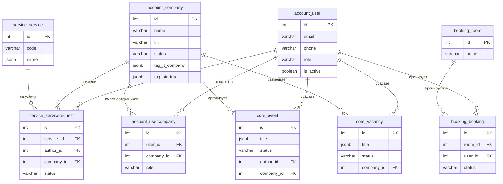
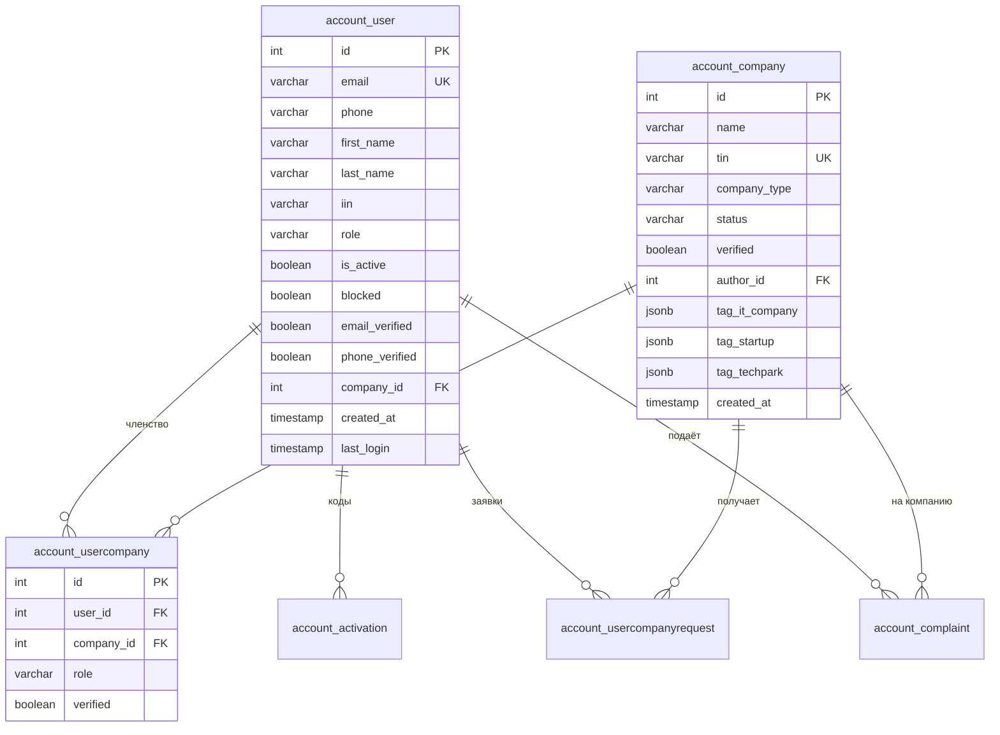
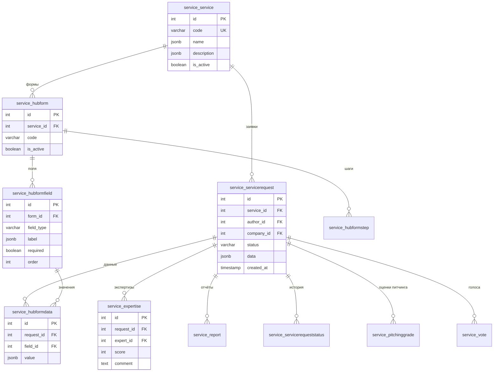
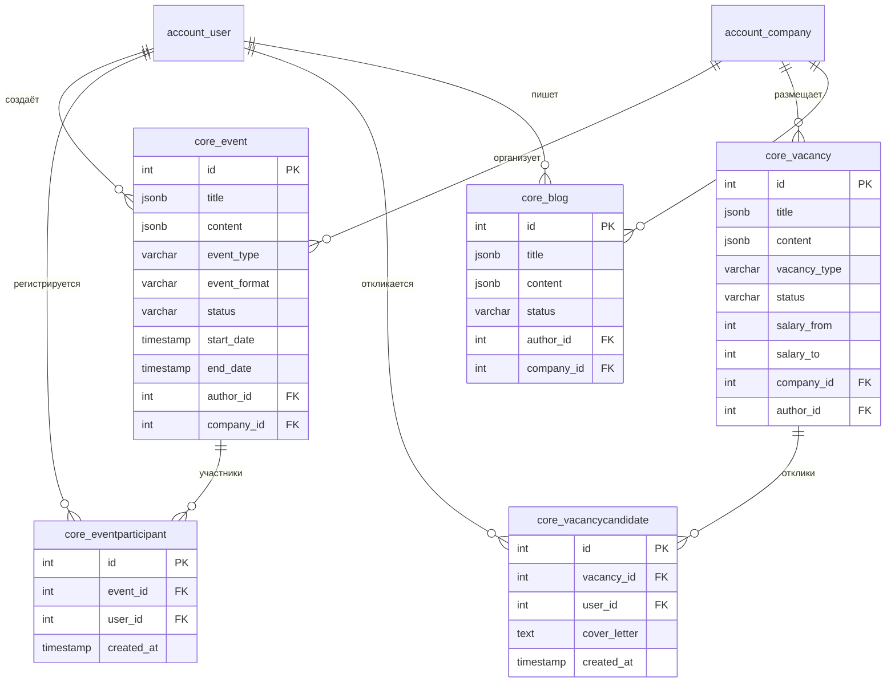
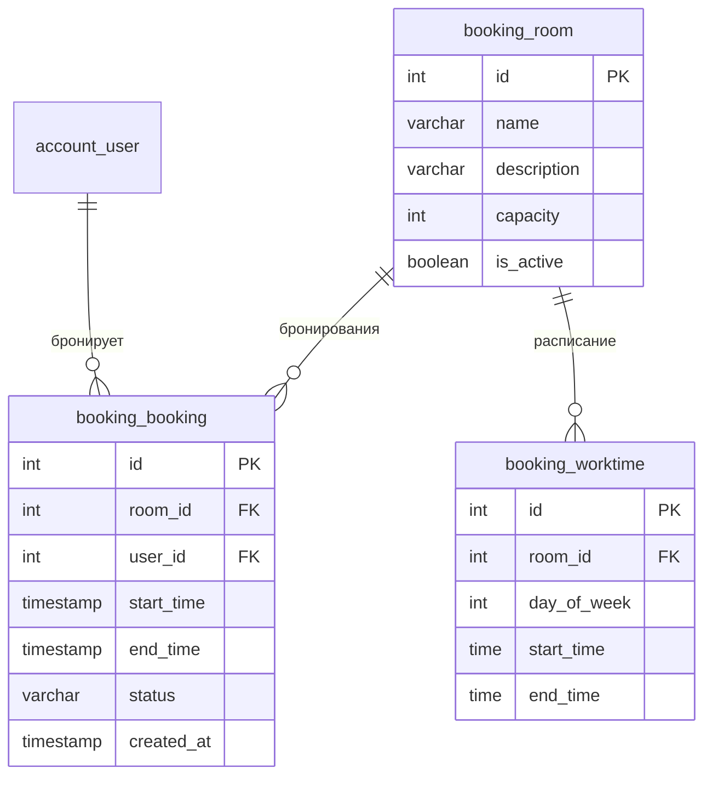
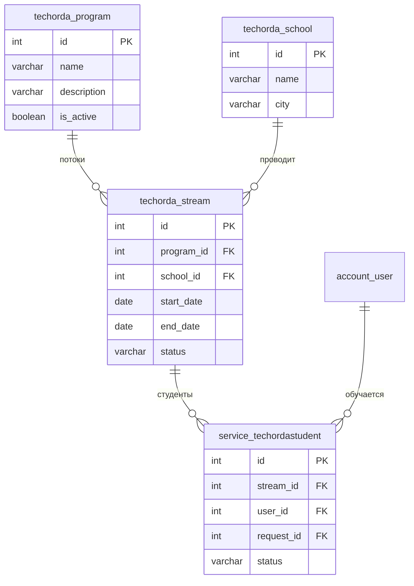

# Модель данных TechHub

## Общая статистика

| Показатель | Значение |
|------------|----------|
| Всего таблиц | 157 |
| Бизнес-таблиц | 103 |
| Технических таблиц | 54 |
| Внешних ключей (FK) | 218 |

---

## ER-диаграмма: Ядро системы



---

## Домен ACCOUNT

### Таблицы и связи

| Таблица | Записей | PK | Основные FK |
|---------|---------|----|--------------|
| account_user | 54,063 | id | company_id → account_company |
| account_company | 6,639 | id | author_id → account_user |
| account_usercompany | 4,536 | id | user_id, company_id |
| account_activation | 1,810 | uuid | user_id → account_user |
| account_usercompanyrequest | 254 | id | user_id, company_id |
| account_emaildigest | 31,474 | id | — |
| account_complaint | 20 | id | author_id, user_id, company_id |
| account_usercompanyinvitation | 2 | id | company_id, author_id, invited_user_id |

### ER-диаграмма ACCOUNT



---

## Домен SERVICE

### Таблицы и связи

| Таблица | Записей | PK | Основные FK |
|---------|---------|----|--------------|
| service_service | 310 | id | — |
| service_servicerequest | 56,322 | id | service_id, author_id, company_id |
| service_hubform | 282 | id | service_id |
| service_hubformfield | 6,603 | id | form_id |
| service_hubformdata | 61,635 | id | request_id, field_id |
| service_expertise | 787 | id | request_id, expert_id |
| service_protocol | 104 | id | — |
| service_report | 13,110 | id | request_id |
| service_pitchinggrade | 1,538 | id | request_id |
| service_vote | 12,945 | id | request_id, user_id |

### ER-диаграмма SERVICE



---

## Домен CORE

### Таблицы и связи

| Таблица | Записей | PK | Основные FK |
|---------|---------|----|--------------|
| core_event | 1,459 | id | author_id, company_id, organization_id |
| core_eventparticipant | 864 | id | event_id, user_id |
| core_vacancy | 1,205 | id | author_id, company_id |
| core_vacancycandidate | 5,344 | id | vacancy_id, user_id |
| core_blog | 1,801 | id | author_id, company_id |
| core_article | 83 | id | author_id |
| core_comment | 2,585 | id | author_id (полиморфная связь) |
| core_feed | 4,789 | id | (полиморфная связь) |
| core_notification | 1,233 | id | user_id |
| core_actionlog | 124,987 | id | user_id |

### ER-диаграмма CORE



---

## Домен BOOKING

### ER-диаграмма BOOKING



---

## Домен TECHORDA

### ER-диаграмма TECHORDA



---

## Полиморфные связи

### core_comment (Комментарии)

Комментарии могут быть привязаны к разным типам контента через комбинацию полей:

| Поле | Описание |
|------|----------|
| source | Тип контента: 'event', 'vacancy', 'blog', 'article' |
| primary_key | ID записи в соответствующей таблице |

```
core_comment
├── source='event' + primary_key=123 → core_event.id=123
├── source='vacancy' + primary_key=456 → core_vacancy.id=456
└── source='blog' + primary_key=789 → core_blog.id=789
```

### core_feed (Лента)

Аналогично комментариям, лента агрегирует разные типы контента.

---

## Мультиязычные поля (JSONB)

Многие текстовые поля хранят данные на трёх языках:

```json
{
  "ru": "Текст на русском",
  "kk": "Қазақша мәтін",
  "en": "English text"
}
```

**Таблицы с мультиязычностью:**

| Таблица | Поля |
|---------|------|
| core_event | title, content, address |
| core_vacancy | title, content, requirements |
| core_blog | title, content |
| core_article | title, content |
| service_service | name, description |
| service_hubformfield | label, placeholder, help_text |
| core_category | name |
| core_city | name |

---

## Теги как JSONB

Теги компаний и пользователей хранятся в JSONB-полях:

```json
{
  "status": "active",
  "date_from": "2024-01-15",
  "date_to": null,
  "data": {
    "certificate_number": "123",
    "approved_by": 456
  }
}
```

**Проверка активного тега:**
```
tag_it_company->>'status' = 'active'
```

---

## Индексы и производительность

### Рекомендуемые индексы для аналитики

| Таблица | Поля | Назначение |
|---------|------|------------|
| account_user | created_at | Динамика регистраций |
| account_user | role | Фильтрация по ролям |
| account_company | created_at | Динамика регистраций |
| service_servicerequest | status, created_at | Аналитика заявок |
| service_servicerequest | service_id | Группировка по услугам |
| core_event | status, start_date | Активные события |
| core_vacancy | status, created_at | Активные вакансии |
| booking_booking | status, start_time | Активные брони |

---

## Сводка по доменам

| Домен | Таблиц | Ключевые сущности |
|-------|--------|-------------------|
| ACCOUNT | 16 | user, company, usercompany |
| SERVICE | 34 | service, servicerequest, hubform, hubformdata |
| CORE | 27 | event, vacancy, blog, comment |
| BOOKING | 3 | room, booking |
| TECHORDA | 7 | program, stream, school |
| NIOKR | 5 | project, request |
| SHARED | 6 | file, region |
| *Технические* | 54 | auth, django, logs |

---

## Возврат к содержанию

[README.md](README.md) — Главная страница документации
