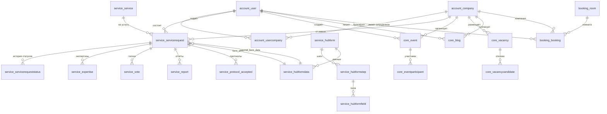

# Модель данных (актуально по схеме БД)

## Общая статистика
| Показатель | Значение |
|------------|----------|
| Таблиц | 157 |
| Внешних ключей | 218 |
| Ключевые бизнес-таблицы | account, service, core, booking, techorda, landing, shared |

## ER-диаграмма ядра (укрупнённо)

## Домены и таблицы (ключевые)

### ACCOUNT
| Таблица | Записей | PK | Основные FK |
|---------|---------|----|-------------|
| account_user | ~54k | id | company_id → account_company, organization_id → core_organization |
| account_company | ~6.6k | id | author_id → account_user |
| account_usercompany | ~4.5k | id | user_id → account_user, company_id → account_company |
| account_activation | ~1.8k | uuid | user_id → account_user |
| account_usercompanyrequest | ~254 | id | user_id, company_id |
| account_usercompanyinvitation | ~2 | id | company_id, author_id, invited_user_id |

### SERVICE
| Таблица | Записей | PK | Основные FK |
|---------|---------|----|-------------|
| service_service | 310 | code | organization_id → core_organization, hub_form_id/second_hub_form_id → service_hubform, page_id → landing_page |
| service_servicerequest | ~56k | id | service_id → service_service.code, author_id/company_id/assignee_id/expert_id → account_user/account_company, hub_form_data_id/second_hub_form_data_id → service_hubformdata, parent_id (self) |
| service_servicerequeststatus | ~82k | id | service_request_id, user_id |
| service_servicerequestlog | ~4.5k | id | service_request_id, user_id |
| service_expertise | ~787 | id | service_request_id, user_id |
| service_vote | ~12.9k | id | service_request_id, hub_form_data_id, user_id |
| service_protocol / accepted / rejected | ~104 / 467 / 606 | id | service_id → service_service.code, servicerequest_id |
| service_report | ~13.1k | id | service_request_id |
| service_hubform | 282 | id | organization_id, service linkage |
| service_hubformstep | 569 | id | hub_form_id |
| service_hubformfield | 6.6k | id | hub_form_step_id |
| service_hubformdata | ~61.6k | id | hub_form_id |
| service_seedmoneyreport, service_techordareport, service_techordareportstudent, service_techordastudent | как в схеме |

### CORE
| Таблица | Записей | PK | Основные FK |
|---------|---------|----|-------------|
| core_event | ~1.5k | id | author_id → account_user, company_id → account_company, organization_id → core_organization |
| core_eventparticipant | ~864 | id | event_id → core_event, author_id → account_user |
| core_vacancy | ~1.2k | id | author_id → account_user, company_id → account_company, city_id → core_city |
| core_vacancycandidate | ~5.3k | id | vacancy_id → core_vacancy, author_id → account_user |
| core_blog | ~1.8k | id | author_id → account_user, company_id → account_company, category_id → core_category |
| core_article | 83 | id | author_id → account_user |
| core_comment | ~2.6k | id | user_id → account_user, parent_id (self), source+primary_key (полиморфно) |
| core_feed | ~4.8k | id | ссылки на article/blog/discussion/event/techtask/vacancy |
| core_notification | ~1.2k | id | user_id → account_user |
| core_actionlog | ~125k | id | user_id → account_user |
| core_category/city/country/organization | справочники |

### BOOKING
| Таблица | Записей | PK | Основные FK |
|---------|---------|----|-------------|
| booking_room | 16 | id | - |
| booking_booking | ~8.7k | id | room_id → booking_room, author_id → account_user, company_id → account_company |
| booking_bookingstatus | ~8.7k | id | booking_id → booking_booking |

### TECHORDA
| Таблица | Записей | PK | Основные FK |
|---------|---------|----|-------------|
| techorda_course | 203 | id | flow_id → techorda_flow, school_id → techorda_school |
| techorda_flow | 4 | id | - |
| techorda_school | 82 | id | author_id → account_user, company_id → account_company |
| techorda_courseapplication | 15 | id | application_form_id → techorda_applicationform, course_id → techorda_course, flow_id → techorda_flow |
| techorda_coursefavorite | 16 | id | course_id → techorda_course, user_id → account_user |
| techorda_applicationform | 19 | id | assessment_id, author_id, flow_id |

### LANDING
| Таблица | Записей | PK | Основные FK |
|---------|---------|----|-------------|
| landing_page | 562 | id | author_id → account_user, organization_id → core_organization |
| landing_section | 560 | id | page_id → landing_page |
| landing_component | 2.8k | id | section_id → landing_section |
| landing_pagemediafile | 18.5k | id | page_id → landing_page, author_id → account_user |
| landing_landing | 8 | id | устаревший лендинг |

### SHARED
| Таблица | Записей | PK | Основные FK |
|---------|---------|----|-------------|
| shared_mediafile | 50.9k | id | author_id → account_user |
| shared_protectedmediafile | 92.9k | id | author_id → account_user |
| shared_contextdata | 243 | id | - |
| shared_seodata | 97 | id | - |
| shared_smslog | 0 | id | - |
| shared_largecache | 2 | id | - |

### Прочие (тех/безопасность)
- `auth_*`, `oauth2_*`, `authtoken_token`, `waffle_*`, `awsdjangoses_*`, `social_auth_*`, `thumbnail_kvstore`, `user_sessions_session`, `silk_*`, `django_*`, `hub_cache_table`.

## Мультиязычные и JSONB поля (ключевые)
- Мультиязычные: `core_event.title/content`, `core_vacancy.title/description`, `core_blog.title/content`, `core_article.title/content`, `service_service.data` (name/description), `service_hubformfield.label`, `core_category.name`, `core_city.name`, `core_organization.name`, `landing_*` тексты.
- Теги/данные: `account_user.data/tags/permissions`, `account_company.tag_* / basic_info`, `service_hubformdata.data`, `core_event.contact_info`.

## Что исключать из аналитических витрин
- `user_sessions_session`, `django_session`, `silk_*`, `hub_cache_table`, `thumbnail_kvstore`, внутренние кеши/профилирование, кроме целей аудита.

