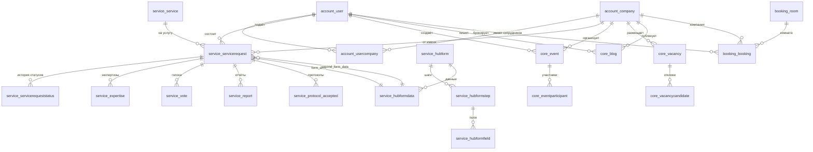

# TechHub – аналитическая документация (актуальная по схеме БД)

## Структура набора документов
| Файл | Назначение |
|------|------------|
| 01_BUSINESS_DOMAINS.md | Доменные области и роли данных |
| 02_ENTITIES.md | Ключевые сущности и бизнес-описания |
| 03_DICTIONARIES.md | Справочники и статусы (фактические) |
| 04_BUSINESS_PROCESSES.md | Процессы и точки данных для аналитики |
| 05_DATA_MODEL.md | Укрупнённая модель данных (по реальной схеме) |

## Источник правды
- PostgreSQL база `techhub`, схема `public` (157 таблиц, 218 FK) — см. `SA_FULL_ENTITY_ANALYSIS.md` в корне.
- Основные домены: `account`, `service`, `core`, `booking`, `techorda`, `landing`, `shared` + тех.таблицы Django/Auth/Logs.
- PK/FK и поля выровнены по фактической схеме (например, `service_service.code` — PK; `service_servicerequest` имеет `assignee_id`, `expert_id`, `hub_form_data_id`, `second_hub_form_data_id`, `parent_id`; `booking_room` = 16 строк, `booking_bookingstatus` есть, `booking_worktime` нет).

## Чем отличаются от старых файлов
- Убраны несуществующие таблицы (`booking_worktime`, `techorda_program/stream`, `shared_file/region` и т.п.).
- Добавлены реальные сущности (`techorda_course/flow/school`, `service_*` поля, `shared_mediafile/protectedmediafile`, `landing_*`).
- Исправлены PK/FK, статусы, мультиязычные и JSONB поля, численности записей.

# Бизнес-домены TechHub (актуально по схеме БД)

## Домены и их роли
| Домен | Префиксы таблиц | Назначение | Ключевые сущности |
|-------|-----------------|------------|-------------------|
| ACCOUNT | `account_` | Идентификация пользователей и компаний | user, company, usercompany, activation, complaint |
| SERVICE | `service_` | Каталог услуг и заявки, экспертиза, формы | service, servicerequest, hubform, hubformdata, expertise, report, protocol, vote |
| CORE | `core_` | Контент: события, вакансии, блоги, статьи, лента, комментарии | event, eventparticipant, vacancy, vacancycandidate, blog, article, comment, feed, notification, actionlog |
| BOOKING | `booking_` | Бронирование комнат | room, booking, bookingstatus |
| TECHORDA | `techorda_` (+ часть `service_`) | Образовательные программы TechOrda | course, flow, school, courseapplication, coursefavorite; в сервисах — techordastudent/report |
| LANDING | `landing_` | CMS для лендингов | landing, page, section, component, pagemediafile |
| SHARED | `shared_` | Общие файлы/медиа/контекст | mediafile, protectedmediafile, contextdata, seodata, smslog, largecache |
| AUTH/SECURITY | `auth_`, `oauth2_`, `authtoken_`, `waffle_`, `awsdjangoses_` | Авторизация, токены, feature-flags, почта | группы/права, OAuth2, токены, флаги |
| Технические | `django_`, `silk_`, `social_auth_`, `thumbnail_`, `user_sessions_`, `hub_cache_table` | Логи, профилирование, сессии, кеши | как в схеме |

## Основные объёмы (по анализу схемы)
- Пользователи: `account_user` ~54k
- Компании: `account_company` ~6.6k
- Заявки на услуги: `service_servicerequest` ~56k
- Данные форм: `service_hubformdata` ~61k
- События: `core_event` ~1.5k; участники ~0.8k
- Вакансии: `core_vacancy` ~1.2k; кандидаты ~5.3k
- Бронирования: `booking_booking` ~8.7k
- Логи действий: `core_actionlog` ~125k
- Сессии: `user_sessions_session` ~2.9M (шум для аналитики)

## Взаимосвязи доменов
- ACCOUNT → SERVICE: автор/компания в заявках; эксперты/исполнители.
- ACCOUNT → CORE: авторы контента, организаторы событий/вакансий/блогов.
- ACCOUNT → BOOKING: автор бронирования.
- ACCOUNT → TECHORDA: студенты/заявки через сервисные таблицы.
- SERVICE → CORE/BOOKING: нет прямых связей, только через пользователей/компании.
- SHARED используется для медиа и SEO/контента в CORE/LANDING/SERVICE.

## Что важно для аналитики
- Статусы и временные метки: заявки, контент, бронирования.
- Теги и JSONB: `account_company.tag_*`, `account_user.data/tags/permissions`, мультиязычные поля `title/content` (ru/kk/en).
- Счётчики и связи M:N: `account_usercompany`, `core_feed`, полиморфные `core_comment`.
- Исключаем из витрин как шум: `user_sessions_session`, `django_session`, `silk_*`, `hub_cache_table`, часть технических кешей.

# Ключевые сущности (по реальной схеме БД)

## 1. Пользователь — `account_user`
- Регистрируется по email или телефону; email/phone могут быть подтверждены.
- Роли/права — через Django группы/permissions; доп. права в JSONB `permissions`.
- Основная компания (`company_id`), организация (`organization_id`), теги/данные в JSONB `data`, `tags`.

Ключевые поля: `id (PK)`, `email`, `phone`, `first_name/last_name`, `iin`, `role`, `is_active/blocked`, `email_verified/phone_verified`, `company_id (FK account_company)`, `organization_id (FK core_organization)`, `created_at`, `updated_at`, `last_login`, `data (jsonb)`, `tags (jsonb)`, `permissions (jsonb)`.

Связи: заявки (`service_servicerequest` автор/исполнитель/эксперт), контент (`core_event/core_vacancy/core_blog`), брони (`booking_booking`), членство (`account_usercompany`), OAuth/токены, комментарии.

## 2. Компания — `account_company`
- Юр.лицо/ИП; получает статусы/теги через услуги (IT-компания, стартап, резидент и др.).
- Автор компании — пользователь; верификация/блокировка.
- Теги в JSONB: `tag_it_company`, `tag_startup`, `tag_techpark`, `tag_corp_partner`, `tag_nii`, `tag_nedrouser`, `tag_ts_member` и др.

Ключевые поля: `id (PK)`, `tin`, `name/short_name`, `company_type`, `status`, `verified`, `address`, `email/phone/website`, `author_id (FK account_user)`, `bank/iik/bik/kbe`, `description`, `tag_* (jsonb)`, `basic_info (jsonb)`, `created_at`, `updated_at`.

Связи: сотрудники (`account_usercompany`), заявки (`service_servicerequest`), события/вакансии (`core_event/core_vacancy`), блоги, TechOrda школы.

## 3. Связь пользователь–компания — `account_usercompany`
- M:N связь с ролью (owner/member/advisor), подтверждение `verified`.
Поля: `id (PK)`, `user_id (FK account_user)`, `company_id (FK account_company)`, `role`, `verified`.

## 4. Услуга — `service_service`
- Каталог услуг; PK — `code` (varchar). Мультиязычные `data` (название/описание), связь с формой/страницей.
Поля: `code (PK)`, `data (jsonb)`, `organization_id (FK core_organization)`, `hub_form_id/second_hub_form_id (FK service_hubform)`, `page_id (FK landing_page)`, статусы активности.

## 5. Заявка на услугу — `service_servicerequest`
- Автор (user), возможно компания, исполнитель/эксперт, родительская заявка, до двух форм данных.
- Статусы: `draft/created/sent/approved/success/reject/rejected`.
Поля (ключевые): `id (PK)`, `service_id (FK service_service.code)`, `status`, `author_id (FK account_user)`, `company_id (FK account_company)`, `assignee_id (FK account_user)`, `expert_id (FK account_user)`, `hub_form_data_id`, `second_hub_form_data_id` (FK service_hubformdata), `parent_id (self)`, `data (jsonb)`, `created_at`, `updated_at`.
Связанные таблицы: `service_servicerequeststatus` (история статусов), `service_servicerequestlog`, `service_expertise`, `service_vote`, `service_report`, `service_protocol_*`, `service_external*`.

## 6. Формы и данные — `service_hubform`, `service_hubformstep`, `service_hubformfield`, `service_hubformdata`
- `service_hubform` — шаблон формы (может быть у услуги 1 или 2).
- `service_hubformdata` — JSONB blob с заполненными данными; привязка к заявке через поля в `service_servicerequest`.
- `service_hubformstep` / `service_hubformfield` — структура формы.

## 7. Событие — `core_event`
- Контент с модерацией, мультиязычные `title/content`, форматы/типы.
Поля: `id (PK)`, `title (jsonb)`, `content (jsonb)`, `slug`, `status`, `event_type`, `event_format`, `datetime_start/end`, `published`, `author_id (FK account_user)`, `company_id (FK account_company)`, `organization_id (FK core_organization)`, `view_count`, `contact_info (jsonb)`.
Связи: участники `core_eventparticipant`, комментарии, лента `core_feed`.

## 8. Вакансия — `core_vacancy`
- Мультиязычные `title/description`, тип занятости, зарплатный диапазон.
Поля: `id (PK)`, `title (jsonb)`, `description (jsonb)`, `status`, `vacancy_type`, `salary_min/max`, `published`, `author_id`, `company_id`, `city_id`.
Связи: отклики `core_vacancycandidate`, лента `core_feed`.

## 9. Блог/Статья — `core_blog`, `core_article`
- Мультиязычные поля, статусы модерации, просмотры/реакции.
Поля: `id (PK)`, `title (jsonb)`, `content (jsonb)`, `slug`, `status`, `published`, `author_id`, `company_id`, `category_id`, `tags/arrays`, `view_count`.

## 10. Комментарий — `core_comment`
- Полиморфная привязка: `source` + `primary_key`, self-FK `parent_id`.
Поля: `id (PK)`, `message`, `source`, `primary_key`, `user_id (FK account_user)`, `parent_id (self)`, `status`, реакции (arrays).

## 11. Лента — `core_feed`
- Агрегатор контента: ссылки на article/blog/discussion/event/techtask/vacancy.
Поля: `id (PK)`, FK на разные сущности, `created_at`, `published`, `status`.

## 12. Бронирование — `booking_room`, `booking_booking`, `booking_bookingstatus`
- `booking_room`: справочник комнат (16 строк).
- `booking_booking`: факт брони с `room_id`, `author_id`, `company_id`, `start/end`, `status (active/finished/deactivated)`.
- `booking_bookingstatus`: история смены статусов.

## 13. TechOrda (обучение)
- Таблицы: `techorda_course`, `techorda_flow`, `techorda_school`, `techorda_applicationform`, `techorda_courseapplication`, `techorda_coursefavorite`.
- В сервисах: `service_techordastudent`, `service_techordareport`, `service_techordareportstudent`.

## 14. Медиа и SEO — `shared_mediafile`, `shared_protectedmediafile`, `shared_contextdata`, `shared_seodata`, `shared_smslog`, `shared_largecache`.
- Публичные/защищённые файлы, SEO/контекст, SMS логи.

# Справочники и статусы (фактические)

## Статусы заявок `service_servicerequest.status`
| Код | Описание |
|-----|----------|
| draft | Черновик |
| created | Создана (для части услуг) |
| sent | На рассмотрении |
| correction | На доработке |
| approved | Предварительно одобрена |
| success | Успешно завершена |
| reject | Отклонена |
| rejected | Отклонена (альт. код) |

## Статусы контента (события/вакансии/блоги/статьи)
| Код | Описание |
|-----|----------|
| draft | Черновик |
| sent | На модерации |
| correction | На доработке |
| success | Опубликовано |
| reject | Отклонено |
| deleted | Удалено |

## Бронирование `booking_booking.status`
| Код | Описание |
|-----|----------|
| active | Подтверждено |
| finished | Завершено |
| deactivated | Отменено |

## Мероприятия
- `core_event.event_type`: `open_event`, `closed_event`
- `core_event.event_format`: `astanahub`, `online`, `hybrid`

## Вакансии
- `core_vacancy.vacancy_type`: `fulltime`, `parttime`, `internship`, `project`, `volunteering`, `absense_period`

## Компании
- `account_company.company_type`: `law`, `ip`, `unknown`
- `account_company.status`: `active`, `blocked`
- Теги (JSONB): `tag_it_company`, `tag_startup`, `tag_techpark`, `tag_corp_partner`, `tag_nii`, `tag_nedrouser`, `tag_ts_member`, …

## Пользователи
- Системные роли (ключевые): `user`, `admin`, `superadmin`, `moderator`, `expert`, `manager`, `techorda_manager`, `niokr_admin`, др.
- Теги (JSONB `data`/`tags`): `tag_investor`, `tag_it_specialist`, `tag_intern`, `tag_expert`, `tag_startup_member`, `tag_company_member`, `tag_student`, `tag_teacher`, `tag_scientist`, `tag_ai_specialist`, …

## Мультиязычные поля (JSONB ru/kk/en)
Таблицы: `core_event`, `core_vacancy`, `core_blog`, `core_article`, `service_service`, `service_hubformfield`, `core_category`, `core_city`, `core_organization` (name), `landing_*` контент.

Пример структуры:
```json
{"ru": "Заголовок", "kk": "Тақырып", "en": "Title"}
```

## Поля JSONB (ключевые для разворота в Silver/BI)
- `account_user.data`, `account_user.tags`, `account_user.permissions`
- `account_company.tag_*`, `account_company.basic_info`
- `service_hubformdata.data` (динамические формы услуг)
- `service_service.data` (название/описание услуг)
- `core_event.contact_info`, `core_event.title/content`, `core_vacancy.title/description`, `core_blog.title/content`

# Бизнес-процессы (фактические статусы/поля)

## 1. Заявка на услугу (SERVICE)
Участники: Автор (user), Компания (optional), Исполнитель/Эксперт (user), Модератор.

Жизненный цикл:
```
draft -> created -> sent -> (correction -> sent) -> approved -> success / reject|rejected
```

Критичные данные для аналитики:
- `service_servicerequest`: `status`, `service_id`, `author_id`, `company_id`, `assignee_id`, `expert_id`, `parent_id`, `created_at`, `updated_at`, `hub_form_data_id`, `second_hub_form_data_id`.
- История статусов: `service_servicerequeststatus` (кто/когда).
- Экспертизы/голоса: `service_expertise`, `service_vote`.
- Протоколы/отчёты: `service_protocol_*`, `service_report`, `service_seedmoneyreport`, `service_techordareport`.
- Данные формы: `service_hubformdata.data` (JSONB), привязка через поля заявки.

Метрики: конверсия по статусам, T2Approve/T2Success, доля отклонений, нагрузка по исполнителям/экспертам, успешность по услугам.

## 2. Контент (CORE) — события/вакансии/блоги/статьи
Жизненный цикл (общий): `draft -> sent -> correction -> success | reject | deleted`

События (`core_event`):
- Поля: `event_type`, `event_format`, `status`, `datetime_start/end`, `published`, `company_id/organization_id`, `view_count`, `contact_info (jsonb)`.
- Участники: `core_eventparticipant`.
Метрики: публикации, регистрации/участники, просмотры, конверсия участник/просмотр, по организаторам.

Вакансии (`core_vacancy`):
- Поля: `vacancy_type`, `status`, `salary_min/max`, `city_id`, `company_id`, `published`.
- Кандидаты: `core_vacancycandidate`.
Метрики: активные вакансии, кандидаты/вакансию, средние зарплаты, время жизни вакансии.

Блоги/статьи (`core_blog`, `core_article`):
- Поля: мультиязычное `title/content`, `status`, `published`, `author_id/company_id`, `category_id`, `view_count`, реакции.
Метрики: публикации, просмотры, реакции, по авторам/компаниям.

Комментарии (`core_comment`):
- Поля: `source`, `primary_key`, `parent_id`, `user_id`, `status`, реакции.
Метрики: активность комментариев по типам контента.

Лента (`core_feed`):
- Ссылается на article/blog/discussion/event/techtask/vacancy.
Использование: агрегаты по типам контента, “топы”.

## 3. Бронирование (BOOKING)
Процесс: создать бронь → активна → завершается по времени или отменяется.
- Таблицы: `booking_room`, `booking_booking`, `booking_bookingstatus`.
- Поля важные: `room_id`, `author_id`, `company_id`, `start`, `end`, `status`.
- Метрики: загрузка комнат, отмены, пересечения (DQ), длительность.

## 4. TechOrda (обучение)
- Сущности: `techorda_course`, `techorda_flow`, `techorda_school`, заявки/избранное курсов; в сервисах — `service_techordastudent`, `service_techordareport`.
- Процессы: запись на курс (через service), обучение, отчётность.
- Метрики: заявки/студенты по курсам/школам, выпуск/отчёты.

## 5. Медиа/SEO/файлы (SHARED)
- `shared_mediafile`, `shared_protectedmediafile`, `shared_contextdata`, `shared_seodata`, `shared_smslog`.
- Использование: ресурсы для контента/лендингов, лог SMS.

## 6. Авторизация/безопасность
- Таблицы: `auth_*`, `oauth2_*`, `authtoken_token`, `waffle_*`, `awsdjangoses_*`, `social_auth_*`.
- Метрики: не для BI контента; использовать аккуратно для аудита/безопасности.

## 7. Технические/шумовые
- `user_sessions_session`, `django_session`, `silk_*`, `hub_cache_table`, `thumbnail_kvstore` и др. — исключать из аналитических витрин (шум/кеш).

# Модель данных (актуально по схеме БД)

## Общая статистика
| Показатель | Значение |
|------------|----------|
| Таблиц | 157 |
| Внешних ключей | 218 |
| Ключевые бизнес-таблицы | account, service, core, booking, techorda, landing, shared |

## ER-диаграмма ядра (укрупнённо)


## Домены и таблицы (ключевые)

### ACCOUNT
| Таблица | Записей | PK | Основные FK |
|---------|---------|----|-------------|
| account_user | ~54k | id | company_id → account_company, organization_id → core_organization |
| account_company | ~6.6k | id | author_id → account_user |
| account_usercompany | ~4.5k | id | user_id → account_user, company_id → account_company |
| account_activation | ~1.8k | uuid | user_id → account_user |
| account_usercompanyrequest | ~254 | id | user_id, company_id |
| account_usercompanyinvitation | ~2 | id | company_id, author_id, invited_user_id |

### SERVICE
| Таблица | Записей | PK | Основные FK |
|---------|---------|----|-------------|
| service_service | 310 | code | organization_id → core_organization, hub_form_id/second_hub_form_id → service_hubform, page_id → landing_page |
| service_servicerequest | ~56k | id | service_id → service_service.code, author_id/company_id/assignee_id/expert_id → account_user/account_company, hub_form_data_id/second_hub_form_data_id → service_hubformdata, parent_id (self) |
| service_servicerequeststatus | ~82k | id | service_request_id, user_id |
| service_servicerequestlog | ~4.5k | id | service_request_id, user_id |
| service_expertise | ~787 | id | service_request_id, user_id |
| service_vote | ~12.9k | id | service_request_id, hub_form_data_id, user_id |
| service_protocol / accepted / rejected | ~104 / 467 / 606 | id | service_id → service_service.code, servicerequest_id |
| service_report | ~13.1k | id | service_request_id |
| service_hubform | 282 | id | organization_id, service linkage |
| service_hubformstep | 569 | id | hub_form_id |
| service_hubformfield | 6.6k | id | hub_form_step_id |
| service_hubformdata | ~61.6k | id | hub_form_id |
| service_seedmoneyreport, service_techordareport, service_techordareportstudent, service_techordastudent | как в схеме |

### CORE
| Таблица | Записей | PK | Основные FK |
|---------|---------|----|-------------|
| core_event | ~1.5k | id | author_id → account_user, company_id → account_company, organization_id → core_organization |
| core_eventparticipant | ~864 | id | event_id → core_event, author_id → account_user |
| core_vacancy | ~1.2k | id | author_id → account_user, company_id → account_company, city_id → core_city |
| core_vacancycandidate | ~5.3k | id | vacancy_id → core_vacancy, author_id → account_user |
| core_blog | ~1.8k | id | author_id → account_user, company_id → account_company, category_id → core_category |
| core_article | 83 | id | author_id → account_user |
| core_comment | ~2.6k | id | user_id → account_user, parent_id (self), source+primary_key (полиморфно) |
| core_feed | ~4.8k | id | ссылки на article/blog/discussion/event/techtask/vacancy |
| core_notification | ~1.2k | id | user_id → account_user |
| core_actionlog | ~125k | id | user_id → account_user |
| core_category/city/country/organization | справочники |

### BOOKING
| Таблица | Записей | PK | Основные FK |
|---------|---------|----|-------------|
| booking_room | 16 | id | - |
| booking_booking | ~8.7k | id | room_id → booking_room, author_id → account_user, company_id → account_company |
| booking_bookingstatus | ~8.7k | id | booking_id → booking_booking |

### TECHORDA
| Таблица | Записей | PK | Основные FK |
|---------|---------|----|-------------|
| techorda_course | 203 | id | flow_id → techorda_flow, school_id → techorda_school |
| techorda_flow | 4 | id | - |
| techorda_school | 82 | id | author_id → account_user, company_id → account_company |
| techorda_courseapplication | 15 | id | application_form_id → techorda_applicationform, course_id → techorda_course, flow_id → techorda_flow |
| techorda_coursefavorite | 16 | id | course_id → techorda_course, user_id → account_user |
| techorda_applicationform | 19 | id | assessment_id, author_id, flow_id |

### LANDING
| Таблица | Записей | PK | Основные FK |
|---------|---------|----|-------------|
| landing_page | 562 | id | author_id → account_user, organization_id → core_organization |
| landing_section | 560 | id | page_id → landing_page |
| landing_component | 2.8k | id | section_id → landing_section |
| landing_pagemediafile | 18.5k | id | page_id → landing_page, author_id → account_user |
| landing_landing | 8 | id | устаревший лендинг |

### SHARED
| Таблица | Записей | PK | Основные FK |
|---------|---------|----|-------------|
| shared_mediafile | 50.9k | id | author_id → account_user |
| shared_protectedmediafile | 92.9k | id | author_id → account_user |
| shared_contextdata | 243 | id | - |
| shared_seodata | 97 | id | - |
| shared_smslog | 0 | id | - |
| shared_largecache | 2 | id | - |

### Прочие (тех/безопасность)
- `auth_*`, `oauth2_*`, `authtoken_token`, `waffle_*`, `awsdjangoses_*`, `social_auth_*`, `thumbnail_kvstore`, `user_sessions_session`, `silk_*`, `django_*`, `hub_cache_table`.

## Мультиязычные и JSONB поля (ключевые)
- Мультиязычные: `core_event.title/content`, `core_vacancy.title/description`, `core_blog.title/content`, `core_article.title/content`, `service_service.data` (name/description), `service_hubformfield.label`, `core_category.name`, `core_city.name`, `core_organization.name`, `landing_*` тексты.
- Теги/данные: `account_user.data/tags/permissions`, `account_company.tag_* / basic_info`, `service_hubformdata.data`, `core_event.contact_info`.

## Что исключать из аналитических витрин
- `user_sessions_session`, `django_session`, `silk_*`, `hub_cache_table`, `thumbnail_kvstore`, внутренние кеши/профилирование, кроме целей аудита.

