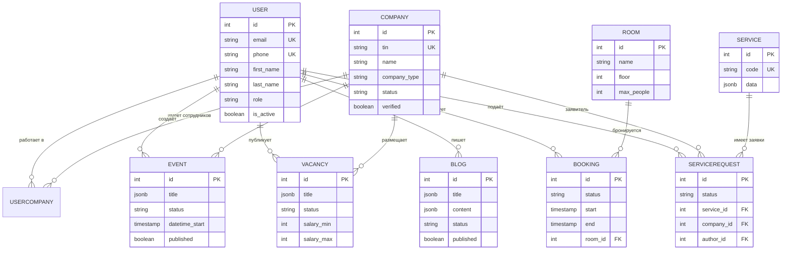
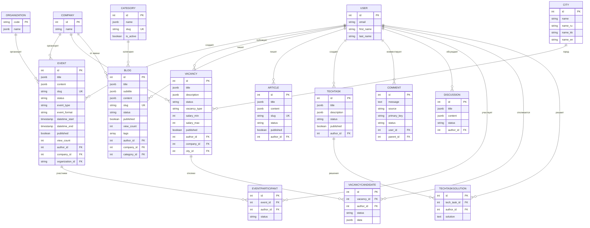

# TechHub - ER-диаграммы

> **Примечание:** Диаграммы в формате Mermaid. Для просмотра используйте:
> - GitHub / GitLab (рендерит автоматически)
> - VS Code с расширением "Markdown Preview Mermaid Support"
> - https://mermaid.live (онлайн-редактор)
> - Confluence / Notion (поддерживают Mermaid)

---

## 1. Общая диаграмма связей (High-Level)



---

## 2. Модуль Account (Пользователи и Компании)


---

## 3. Модуль Service (Государственные услуги)


---

## 4. Модуль Core (Контент)



---

## 5. Модуль Booking (Бронирование)


---

## 6. Модуль TechOrda (Образование)


---

## 7. Полиморфные связи

### core_comment (Комментарии)

Комментарии используют полиморфную связь для привязки к разным сущностям:

```
┌─────────────────────────────────────────────────────────────────┐
│                    POLYMORPHIC: core_comment                     │
├─────────────────────────────────────────────────────────────────┤
│                                                                  │
│  source = 'blog'     + primary_key ──────► core_blog.id         │
│  source = 'event'    + primary_key ──────► core_event.id        │
│  source = 'vacancy'  + primary_key ──────► core_vacancy.id      │
│  source = 'techtask' + primary_key ──────► core_techtask.id     │
│  source = 'discussion' + primary_key ───► core_discussion.id    │
│                                                                  │
│  parent_id FK ──────► core_comment.id (вложенные комментарии)   │
│                                                                  │
└─────────────────────────────────────────────────────────────────┘
```

### core_feed (Лента)

Лента агрегирует контент из разных источников:

```
┌─────────────────────────────────────────────────────────────────┐
│                    POLYMORPHIC: core_feed                        │
├─────────────────────────────────────────────────────────────────┤
│                                                                  │
│  source = 'blog'       ──► blog_id FK                           │
│  source = 'event'      ──► event_id FK                          │
│  source = 'article'    ──► article_id FK                        │
│  source = 'techtask'   ──► tech_task_id FK                      │
│  source = 'discussion' ──► discussion_id FK                     │
│  source = 'vacancy'    ──► vacancy_id FK                        │
│                                                                  │
└─────────────────────────────────────────────────────────────────┘
```

---

## 8. Матрица связей

|  | user | company | event | vacancy | blog | service_request | booking |
|--|------|---------|-------|---------|------|-----------------|---------|
| **user** | - | M:N | 1:N | 1:N | 1:N | 1:N | 1:N |
| **company** | M:N | - | 1:N | 1:N | 1:N | 1:N | 1:N |
| **event** | N:1 | N:1 | - | - | - | - | - |
| **vacancy** | N:1 | N:1 | - | - | - | - | - |
| **blog** | N:1 | N:1 | - | - | - | - | - |
| **service_request** | N:1 | N:1 | - | - | - | - | - |
| **booking** | N:1 | N:1 | - | - | - | - | - |

**Легенда:**
- `1:N` — один ко многим
- `N:1` — многие к одному
- `M:N` — многие ко многим (через промежуточную таблицу)

---

*Далее: [04_DICTIONARIES.md](04_DICTIONARIES.md) — Справочники значений*
